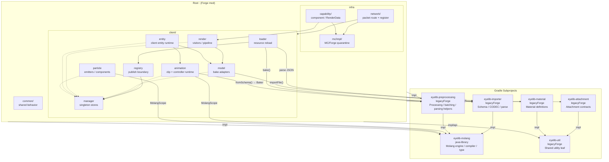

# Eyelib Architecture Blueprint

## Module Relationships

## Communication Lanes
- **Write lane**: loaders parse → publish via registry → managers store
- **Read lane**: runtime modules query `*Lookup` facades, not `Eyelib.getXManager()` reach-through
- **Sync lane**: packets route to domain apply services (`ClientRenderSyncService`, `ParticleSpawnService`)
- **Notification lane**: `MinecraftForge.EVENT_BUS` for coarse invalidation only

## Target Roles
- `eyelib-molang`: Molang engine / compiler / type system (no MC/Forge deps)
- `eyelib-importer`: schema definitions / CODECs / raw JSON parsing (no runtime execution)
- `eyelib-preprocessing`: Forge-side processing / batching / parsing helpers (no root runtime deps)
- `eyelib-util`: shared Forge-aware utility leaf module with no project-internal dependencies
- `eyelib-attachment`: typed attachment contracts and attachment packet contracts; consumes `eyelib-util` stream codecs
- `eyelib-material`: Bedrock material definitions; consumes `eyelib-util` codec infrastructure
- `bootstrap`: composition root only
- `client/loader`: parse-only resource loading pipeline
- `client/registry`: publication boundary from parsed data into runtime stores
- `client/manager`: observable runtime stores
- `client/* runtime`: lookup- and service-driven readers
- `network/*`: routing and packet registration only
- `network/dataattach`: sync service seam between packets and local attachment state

## Execution Priorities
1. Normalize all asset publication through `client/registry`
2. Move packet application logic into domain services; keep `NetClientHandlers` shallow
3. Introduce lookup facades for core runtime reads
4. Extract pure-data conversions to `eyelib-preprocessing` (processing pattern)
5. Migrate `eyelib-importer` to pure `java-library` after `StringRepresentable`/`ExtraCodecs` cleanup

## Rules
- New cross-module writes must not go directly from UI or loader into manager singletons
- New cross-module reads should prefer lookup facades inside the target domain
- New packet handlers should route immediately into a domain apply service
- Once a legacy read/write path is replaced, delete the old path in the same stage
- `eyelib-util` must remain a dependency leaf: consumers may depend on it, but it must not depend on root or sibling Gradle projects
