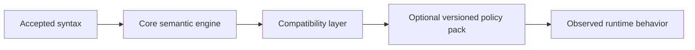

# Compatibility Semantics Matrix

## Purpose
- This document separates **accepted syntax** from **runtime compatibility behavior**.
- It turns the compatibility concerns mentioned across earlier drafts into a first-stage decision matrix.
- It answers:
  - what behavior is official vs community-observed,
  - what behavior the rewrite should treat as required in v1,
  - what behavior should be deferred or isolated behind compatibility policy.

## Relationship To Other Docs
- `molang-syntax-baseline.md` defines what syntax the parser should accept.
- `molang-ast-and-semantics-draft.md` says compatibility quirks belong in a separate layer.
- `host-injection-api-draft.md`, `query-variant-registry-draft.md`, and related docs describe the main semantic engine; this document constrains where that engine must emulate existing Molang behavior.

## Repository Boundary Reminder
- This document defines engine compatibility policy, not platform-specific Minecraft wiring.
- Platform/runtime examples may appear here, but root-side ownership rules remain unchanged.

---

## 1. Compatibility Philosophy

### 1.1 Core rule
- Syntax acceptance and compatibility semantics are different responsibilities.

### 1.2 First-stage implementation bias
- v1 should be:
  - strict about documented syntax,
  - conservative about undocumented runtime quirks,
  - explicit about what is guaranteed,
  - structured so additional behavior packs/version policies can be added later.

### 1.3 Status vocabulary
- **Required**: must be implemented in the first compatibility layer.
- **Targeted**: should be implemented soon, but can be staged after core parser/binder work.
- **Deferred**: not required for first implementation.
- **Avoid baking in**: known behavior, but should not be hard-coded deep into the core if it can be isolated.

---

## 2. Matrix Columns

Each row below uses the following columns:

- **Area**: semantic concern
- **Evidence level**: official / community / implementation survey
- **Observed behavior**: what sources say happens
- **V1 posture**: Required / Targeted / Deferred / Avoid baking in
- **Design placement**: parser / binder / runtime / compatibility layer / versioned policy
- **Notes**: rationale and cautions

---

## 3. Compatibility Matrix

| Area | Evidence level | Observed behavior | V1 posture | Design placement | Notes |
|---|---|---|---|---|---|
| Alias normalization (`q/t/v/c`) | official + community | aliases are common and expected | Required | binder | Should canonicalize early to stable roots |
| Zero-arg query call omission | community + ecosystem practice | zero-arg queries often omit `()` | Targeted | binder/runtime surface | Parser may still normalize to a call-like semantic node |
| `temp.` structs unsupported | community | `temp.` variables do not support structs in practice | Targeted | compatibility layer | Do not hard-code into generic struct model until policy is explicit |
| `->` short-circuit on invalid left side | community | invalid/stale left side short-circuits | Required | runtime / compatibility layer | Keep parser generic; short-circuit is semantic behavior |
| Multiple `->` in one statement restrictions | community | may be restricted/problematic | Deferred | versioned policy | Need stronger evidence before core restriction |
| Array index float-to-int conversion | official | indices are float-cast to int | Required | runtime | Part of normal value semantics |
| Array negative index clamp / wrap behavior | official/community | negative clamps, large indexes wrap | Required | runtime / compatibility layer | Precise behavior should be covered by acceptance corpus later |
| Runtime fallback to neutral values (often `0.0`) | community + query practice | many failures degrade to neutral values | Targeted | compatibility layer / query defaults | Prefer explicit default variants over ad hoc silent fallback |
| Strings single-quoted, limited escaping | official + community | single-quoted strings, odd/limited escaping | Required | lexer/parser | Keep exact behavior narrow and documented |
| Case-insensitivity except strings | official | identifiers/operators are case-insensitive | Required | lexer/binder | Preserve string content case |
| Ternary associativity/version quirks | community + official version notes | behavior changed across versions | Targeted | versioned policy | Do not entangle base parser with version policy unnecessarily |
| `initialize` / `pre_animation` lazy concatenation | community | strings are concatenated lazily in practice | Deferred | integration policy | Likely belongs above core Molang engine |
| Query unavailable -> neutral fallback | ecosystem pattern | unresolved query often behaves like neutral result | Targeted | query registry default variants | Prefer explicit default descriptor entries |
| Query subtype-specific behavior (`Vex`, `Warden`, etc.) | implementation + domain knowledge | subtype quirks exist | Required | query variant registry | Keep in query semantics, not generic type layer |
| Trait aggregation before host-shape specialization | internal design rule | multiple candidate variants force conservative analysis | Required | binder/analysis | Needed for partial evaluation correctness |
| Host role ambiguity (`self` vs `target`) | internal design rule | raw type alone is insufficient | Required | host injection / compatibility policy | Must fail loudly or require explicit role |
| Generated-parser read-only status | repo constraint | generated zone is not normal handwritten logic | Required | repo policy, not runtime | Important for implementation workflow, not language semantics |

---

## 4. Semantic Placement Rules

## 4.1 Parser responsibilities
- Accept documented syntax.
- Preserve enough structure for downstream compatibility semantics.
- Avoid embedding community runtime quirks directly unless they are truly syntactic.

## 4.2 Binder responsibilities
- Canonicalize aliases.
- Normalize query/call forms.
- Produce semantic nodes that allow compatibility policy to act later.

## 4.3 Runtime responsibilities
- Implement stable core value semantics:
  - numeric conversion,
  - array indexing semantics,
  - evaluation order,
  - short-circuit behavior where established.

## 4.4 Compatibility layer responsibilities
- Handle behavior that is:
  - source-backed but not core-grammar-defining,
  - community-observed,
  - version-sensitive,
  - better isolated than baked into the main semantic core.

## 4.5 Versioned policy responsibilities
- Handle behavior whose meaning differs across engine versions or content-pack expectations.

---

## 5. Recommended First-Stage Scope

### 5.1 Must-have for v1
- alias normalization
- case-insensitive identifier handling
- single-quoted string handling
- documented control-flow and expression semantics
- array index conversion/clamp-wrap behavior
- `->` short-circuit behavior
- query variant-based subtype dispatch
- conservative analysis for unresolved multi-variant calls

### 5.2 Good second wave
- neutral-fallback policy formalization
- `temp.` struct restrictions if still supported by evidence
- zero-arg query omission normalization details
- explicit versioned ternary/precedence compatibility options

### 5.3 Explicit deferrals
- integration-site behaviors like `initialize` / `pre_animation` concatenation
- poorly evidenced parser-surface restrictions such as hard bans on repeated `->` in one statement

---

## 6. Policy Model Draft

## 6.1 Why this layering matters
- It keeps the core engine understandable.
- It avoids turning every community quirk into a hard-wired parser/runtime rule.
- It allows later version-specific compatibility packs without rewriting the semantic core.

---

## 7. Query-Specific Compatibility Guidance

## 7.1 Default values should be explicit
- If a query degrades to a neutral result, prefer an explicit default variant.

## 7.2 Subtype quirks should remain local
- Keep subtype-specific behavior inside query variants.
- Do not let generic host typing absorb those quirks.

## 7.3 Missing-role behavior
- If a query requires roles not present in the host shape, compatibility policy should decide whether that means:
  - a default variant,
  - unresolved neutral result,
  - or a harder error in strict/debug modes.

---

## 8. Analysis And Partial Evaluation Guidance

## 8.1 Compatibility-aware conservatism
- If compatibility behavior may change runtime results in undocumented ways, analysis should remain conservative.

## 8.2 Safe folding boundaries
- Do not fold through:
  - runtime-only queries,
  - version-sensitive semantics,
  - quirk-sensitive constructs whose exact behavior is still isolated in policy.

---

## 9. Test Planning Guidance

## 9.1 Corpus split
- Build future test corpus in layers:
  1. official syntax/behavior corpus
  2. community-observed compatibility corpus
  3. internal regression corpus

## 9.2 Assertion style
- Mark each test with evidence level and compatibility posture.
- This prevents undocumented quirks from silently becoming “core spec” by accident.

---

## 10. Open Questions
- Should neutral fallback behavior be configurable globally, or only per query family?
- How much of the official version-sensitive behavior should be modeled in the first compatibility policy pack?
- Do we want a strict mode that surfaces unresolved behavior instead of degrading toward neutral values for debugging?

## 11. Immediate Follow-Up
- parser acceptance corpus
- parser strategy draft
- strict/debug diagnostics mode draft
