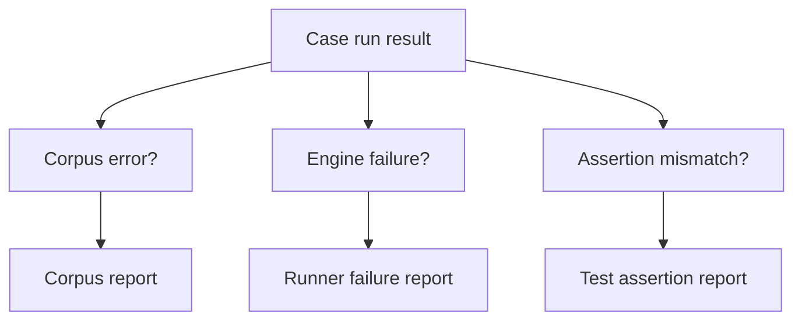

# Corpus Linter / Runner Draft

## Purpose
- This document defines how executable corpus cases are loaded, linted, executed, and asserted.
- It turns the corpus from a file format into an actual validation workflow.

## Relationship To Other Docs
- `executable-corpus-format-draft.md` defines the on-disk case format.
- `strict-debug-diagnostics-mode-draft.md` defines mode-aware expectations.
- `binder-normalization-contract-draft.md` defines what bind-phase assertions should inspect.

## Repository Boundary Reminder
- This is a test harness design for the engine-side rewrite.
- It does not prescribe CI wiring or IDE integration details yet.

---

## 1. High-Level Goals

### 1.1 The harness must support
- corpus file discovery
- metadata parsing and validation
- linting before execution
- multi-phase execution
- mode- and policy-pack-aware expectations
- shallow and golden-style assertions

### 1.2 The harness should separate
- corpus validity errors
- implementation failures
- expectation mismatches

---

## 2. Pipeline Overview


---

## 3. Loader Responsibilities

## 3.1 Discovery
- Walk configured corpus roots.
- Read supported case extensions (for now, assumed `.molangcase`).
- Keep file path separate from stable `id`.

## 3.2 Parsing
- Split front matter from Molang body.
- Parse metadata into a typed case model.
- Attach source location info for corpus-file diagnostics.

## 3.3 Duplicate handling
- Duplicate `id` values are linter errors.
- Duplicate filenames are not semantically meaningful if IDs differ, but should still be considered suspicious.

---

## 4. Linter Responsibilities

## 4.1 Schema validation
- required fields present
- enum values valid
- allowed combinations of assertions respected
- mode expectations only reference supported modes
- policy-pack references syntactically valid

## 4.2 Semantic validation of corpus metadata
- `parse-reject` cases should normally declare expected diagnostics
- `targeted` / `deferred` cases should explain posture
- `debug-trace` assertions should only appear when debug expectations exist

## 4.3 Golden file validation
- referenced goldens exist if declared
- no unsupported golden file types are present

## 4.4 Why linting is a separate phase
- prevents noisy “runner failures” caused by bad test data
- makes corpus maintenance cheaper

---

## 5. Execution Planning

## 5.1 Runner dimensions
- phase
- mode
- policy pack

## 5.2 Example execution matrix
- parse-only case -> parser phase only
- bind-normalize case -> parse + bind
- compat-behavior case -> parse + bind + specialization/runtime path
- debug-trace case -> run debug-enabled execution path

## 5.3 Planning rule
- A case should only execute the minimum phases required for its assertions.

---

## 6. Draft Case Model

```java
record CorpusCase(
    String id,
    String layer,
    String evidence,
    List<String> assertions,
    String source,
    Object expectedShape,
    List<Object> expectedDiagnostics,
    Object modeExpectations,
    String policyPack,
    List<String> notes
) {}
```

Exact runtime types remain open.

---

## 7. Phase Runners

## 7.1 Parse runner
- lex source
- parse AST
- collect parse diagnostics

## 7.2 Bind runner
- consume parse output
- produce `BindResult`
- collect bind diagnostics and summary traits

## 7.3 Compatibility/runtime runner
- apply policy pack if needed
- apply diagnostics-mode overlay
- perform specialization/runtime-compatible evaluation where the case requires it

## 7.4 Debug runner
- same semantic path as requested mode/profile
- plus structured trace capture

---

## 8. Assertion Matching

## 8.1 Parse assertions
- `parse-accept` => no fatal parse failure
- `parse-reject` => fatal parse failure plus expected diagnostics subset

## 8.2 Bind assertions
- `bind-normalize` => parse succeeds and bind output matches expected bind shape subset

## 8.3 Diagnostic assertions
- match on stable fields first:
  - phase
  - severity
  - code
- message text should be advisory, not primary

## 8.4 Debug trace assertions
- match against structured event/type names, not free-form strings where possible

---

## 9. Policy-Pack And Mode Execution

## 9.1 Defaulting rule
- If a case does not name a policy pack, use the documented default pack.
- If a case does not declare mode expectations, run only the default mode implied by assertions.

## 9.2 Explicit matrix cases
- Some cases should intentionally run multiple modes or packs.
- Example: targeted compatibility case may assert different outcomes for normal vs strict.

## 9.3 Report shape
- Reports should say which combination failed:
  - case ID
  - phase
  - mode
  - policy pack

---

## 10. Golden Matching Strategy

## 10.1 Shallow first
- Prefer shallow inline assertions for most cases.

## 10.2 Deep golden support
- For tricky cases, runner should load optional adjacent goldens:
  - parse structure golden
  - bind structure golden
  - diagnostics golden
  - debug trace golden

## 10.3 Matching policy
- Start with subset/contains matching where possible.
- Use exact structural matching only for explicitly golden-locked cases.

---

## 11. Failure Classification

## 11.1 Corpus errors
- malformed front matter
- invalid enum/value
- missing golden
- duplicate ID

## 11.2 Engine failures
- crash/panic/uncaught exception
- unsupported phase combination

## 11.3 Assertion failures
- wrong AST shape
- wrong diagnostics
- wrong strict/debug behavior
- wrong policy-pack outcome

---

## 12. Reporting Model



## 12.1 Minimum report fields
- case ID
- file path
- executed phase(s)
- mode
- policy pack
- result classification
- failing assertion summary

---

## 13. Incremental Implementation Plan

1. corpus loader
2. corpus linter
3. parse-only runner
4. bind runner
5. diagnostic matcher
6. policy-pack-aware runner
7. debug trace runner
8. golden support

---

## 14. Open Questions
- Should the runner support partial-selection filters by layer/evidence/assertion type from day one?
- How much parallelism should the harness use before deterministic reporting becomes harder?
- Should golden mismatch output be normalized diff text, structured diff JSON, or both?

## 15. Immediate Follow-Up
- runtime specialization contract draft
- policy pack selection/configuration draft
- corpus reporter/output format draft
