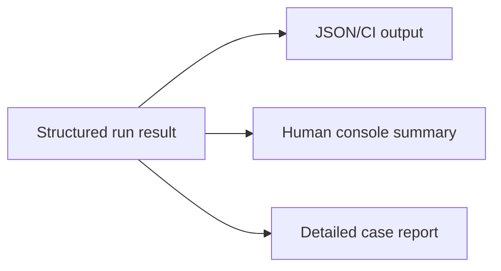

# Corpus Reporter / Output Format Draft

## Purpose
- This document defines the output/report format for corpus lint and runner execution.
- It complements `corpus-linter-runner-draft.md` by specifying what results should look like once cases are executed.

## Relationship To Other Docs
- `corpus-linter-runner-draft.md` defines the execution flow.
- `strict-debug-diagnostics-mode-draft.md` defines diagnostic structures that reports may include.
- `policy-pack-selection-configuration-draft.md` defines effective pack-selection metadata that reports should expose.

## Repository Boundary Reminder
- This is a report contract draft, not a final UI/CLI presentation design.

---

## 1. Report Goals

### 1.1 Must support
- machine-readable results
- human-readable summaries
- separation of corpus errors vs engine failures vs assertion failures
- phase/mode/policy-pack visibility
- stable identifiers for tooling and CI

---

## 2. Result Levels

### Suite level
- overall status
- counts by result category
- environment summary

### Case level
- case identity
- executed phases
- effective mode/policy pack
- pass/fail classification

### Assertion level
- which assertion failed
- expected vs actual summary

---

## 3. Draft Structured Result Shape

```java
record CorpusRunReport(
    String suiteId,
    String overallStatus,
    List<CaseReport> cases,
    Object summary
) {}

record CaseReport(
    String caseId,
    String filePath,
    List<String> phases,
    String mode,
    String policyPack,
    String resultType,
    List<Object> failures,
    List<MolangDiagnostic> diagnostics
) {}
```

---

## 4. Result Categories

Recommended result categories:
- `PASS`
- `CORPUS_ERROR`
- `ENGINE_FAILURE`
- `ASSERTION_FAILURE`
- `SKIPPED`

---

## 5. Human Summary Requirements

## 5.1 Minimum summary
- total cases
- passed cases
- corpus errors
- engine failures
- assertion failures
- skipped cases

## 5.2 Useful breakdowns
- by layer
- by assertion type
- by phase
- by policy pack
- by mode

---

## 6. Failure Payloads

## 6.1 Corpus error payload
- missing/invalid metadata
- duplicate ID
- missing golden reference

## 6.2 Engine failure payload
- exception type/message
- phase
- stack trace or normalized failure data

## 6.3 Assertion failure payload
- assertion kind
- expected summary
- actual summary
- diff reference if available

---

## 7. Draft Output Views



## 7.1 Structured output
- Primary authoritative form.
- Suitable for CI ingestion and tooling.

## 7.2 Human console output
- Short summary first.
- Failing case list second.
- Detailed diffs only on demand or failure.

---

## 8. Normalization Rules

## 8.1 Stable identifiers
- Reports should always prefer stable case IDs over filenames in machine-readable output.

## 8.2 Diagnostics payload policy
- Include structured diagnostics.
- Avoid making raw message text the only artifact.

## 8.3 Mode/pack visibility
- Always record effective mode and effective policy-pack selection for each executed case.

---

## 9. Open Questions
- Should the default human report be terse-by-default with expandable details, or verbose on failure?
- How much of raw stack trace output should be normalized before inclusion in structured results?
- Do we want one canonical JSON schema for all runner outputs from the start?

## 10. Immediate Follow-Up
- specialization cache contract draft
- configuration schema draft
- corpus diff/output UX draft
