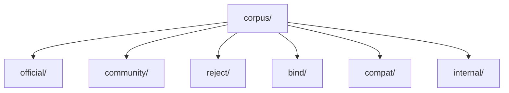

# Executable Corpus Format Draft

## Purpose
- This document defines the concrete on-disk/test-runner format for the parser acceptance corpus.
- It turns `parser-acceptance-corpus.md` from a conceptual corpus into a machine-readable specification.

## Relationship To Other Docs
- `parser-acceptance-corpus.md` defines what kinds of cases exist.
- `strict-debug-diagnostics-mode-draft.md` defines mode-aware diagnostics that some corpus cases must assert.
- `parser-strategy-draft.md` defines the parser/binder boundary that expected shapes should validate.

## Repository Boundary Reminder
- This document specifies test data format, not runtime API format.
- Exact implementation language/tooling for the test runner remains open.

---

## 1. Format Goals

### 1.1 Must support
- parse accept/reject
- bind normalization expectations
- compatibility posture metadata
- mode-specific diagnostic expectations
- stable IDs independent of filenames
- corpus layering by evidence/source

### 1.2 Nice to support later
- snapshot/golden AST summaries
- structured debug trace assertions
- versioned compatibility packs

---

## 2. Recommended Storage Model

## 2.1 File layout
- One test case per file.
- Human-readable text format.
- YAML front matter plus raw Molang source body is the recommended default.

## 2.2 Why this model
- Easy to diff in git.
- Keeps the Molang snippet readable without JSON string escaping noise.
- Allows richer metadata without inventing a custom parser too early.

---

## 3. Draft File Shape

```text
---
id: official.simple-expression.sin
layer: official
evidence: official
assertions:
  - parse-accept
compatibility-posture: required
expected-shape:
  root: CallExpr
  contains:
    - MemberAccess(query.anim_time)
mode-expectations:
  normal: pass
  strict: pass
  debug: pass
notes:
  - baseline official example
---
math.sin(query.anim_time * 1.23)
```

## 3.1 Required front matter fields
- `id`
- `layer`
- `evidence`
- `assertions`

## 3.2 Common optional fields
- `compatibility-posture`
- `expected-shape`
- `expected-diagnostics`
- `mode-expectations`
- `notes`
- `source-reference`

---

## 4. Metadata Schema Draft

## 4.1 Top-level fields

```yaml
id: string
layer: official | community | internal | reject | bind | compat
evidence: official | community | implementation-survey | internal
assertions:
  - parse-accept | parse-reject | bind-normalize | compat-behavior | diagnostic-error | diagnostic-warning | debug-trace | strict-mode-reject
compatibility-posture: required | targeted | deferred | avoid-baking-in
source-reference: string | [string]
notes: [string]
```

## 4.2 Why `layer` and `evidence` are separate
- `layer` groups the corpus operationally.
- `evidence` explains why the case exists.
- Some internal regression tests may still target official behavior, and some compatibility tests may be backed only by community evidence.

---

## 5. Expected Shape Format

## 5.1 Design goal
- Expected shapes should validate parser/binder structure without forcing the corpus to embed full AST dumps by default.

## 5.2 Draft shape schema

```yaml
expected-shape:
  phase: parse | bind
  root: CallExpr
  contains:
    - MemberAccessExpr
    - BinaryExpr[*]
  normalized-roots:
    q: query
    v: variable
```

## 5.3 Recommended rule
- Keep default shape assertions shallow and stable.
- Use deeper golden files only when a case specifically exists to lock down tricky structure.

---

## 6. Diagnostic Expectations

## 6.1 Draft format

```yaml
expected-diagnostics:
  - phase: PARSER
    severity: ERROR
    code: PARSE_UNTERMINATED_STRING
  - phase: BINDER
    severity: WARNING
    code: COMPAT_ZERO_ARG_QUERY_OMISSION
```

## 6.2 Matching policy
- At minimum, corpus runner should support subset matching rather than forcing exact message-string equality.
- Prefer stable `code` + `phase` + `severity` over brittle raw text assertions.

---

## 7. Mode Expectations

## 7.1 Draft shape

```yaml
mode-expectations:
  normal:
    outcome: pass
  strict:
    outcome: diagnostic-warning
  debug:
    outcome: pass
    require-trace:
      - QUERY_VARIANT_SELECTION
      - COMPAT_FALLBACK
```

## 7.2 Why modes need first-class fields
- Some cases are specifically about strict/debug behavior.
- Without explicit mode fields, those expectations become ambiguous or hidden in notes.

---

## 8. Source Body Rules

## 8.1 Body content
- The content after front matter is the exact Molang source under test.

## 8.2 Formatting rule
- Preserve source exactly as intended for the case.
- Multi-line formatting is allowed and should be kept when it aids readability.

## 8.3 String literal caution
- This format avoids escaping the Molang source into a nested JSON string, which is especially useful for single-quoted string cases.

---

## 9. Directory Layout Recommendation



## 9.1 Suggested file naming
- Filename should be human-readable but not the primary key.
- Example:
  - `official/simple-expression-sin.molangcase`
  - `reject/unterminated-string.molangcase`

## 9.2 Primary identity rule
- `id` is the real stable identifier.
- Filenames may change; IDs should not.

---

## 10. Golden File Strategy

## 10.1 When to use golden files
- For tricky structural or diagnostic cases where shallow shape matching is insufficient.

## 10.2 Suggested convention
- Primary case file contains metadata + source.
- Optional adjacent files contain deeper goldens:
  - `.parse.golden.yaml`
  - `.bind.golden.yaml`
  - `.diagnostics.golden.yaml`
  - `.debug-trace.golden.yaml`

## 10.3 Why this split is useful
- Most cases stay compact.
- Only difficult cases carry extra maintenance cost.

---

## 11. Example Cases

## 11.1 Parse accept

```text
---
id: official.ternary.array-index
layer: official
evidence: official
assertions:
  - parse-accept
  - bind-normalize
expected-shape:
  phase: parse
  root: ConditionalExpr
  contains:
    - IndexExpr
compatibility-posture: required
---
query.get_name == 'Toast' ? Texture.toast : Array.skins[query.variant]
```

## 11.2 Parse reject

```text
---
id: reject.unterminated-string
layer: reject
evidence: internal
assertions:
  - parse-reject
expected-diagnostics:
  - phase: PARSER
    severity: ERROR
    code: PARSE_UNTERMINATED_STRING
---
'abc
```

## 11.3 Strict-mode warning

```text
---
id: community.zero-arg-query-omission
layer: community
evidence: community
assertions:
  - parse-accept
  - compat-behavior
compatibility-posture: targeted
mode-expectations:
  normal:
    outcome: pass
  strict:
    outcome: diagnostic-warning
---
query.is_invisible
```

---

## 12. Validation Rules For The Corpus Itself

## 12.1 Required invariants
- every case has a unique `id`
- every case declares at least one assertion
- every `reject` case includes expected diagnostics or an explicit rationale for omission
- every `targeted`/`deferred` case explains its posture in `notes` or metadata

## 12.2 Linting recommendations
- add a corpus linter before the real parser runner exists
- validate enums and required fields first
- only later validate deep golden contracts

---

## 13. Recommended Implementation Sequence

1. define metadata parser
2. implement corpus linter
3. implement parse-accept / parse-reject runner
4. implement shallow expected-shape checks
5. implement diagnostics checks
6. add mode-specific execution and trace assertions

---

## 14. Open Questions
- Should front matter remain YAML, or should the project prefer JSON5/TOML for stricter tooling?
- Should debug-trace assertions live inline in the case file or always in separate goldens?
- Do we want one extension like `.molangcase`, or separate extensions by layer?

## 15. Immediate Follow-Up
- binder normalization contract draft
- compatibility policy pack draft
- corpus linter / runner draft
