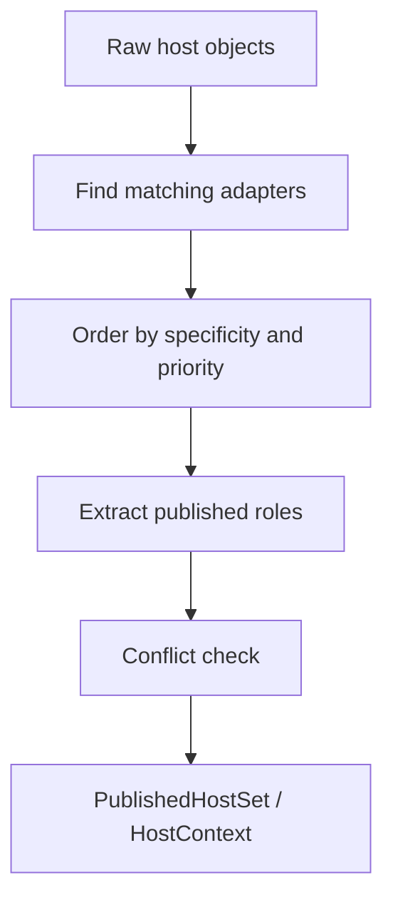

# Host Adapter Registry Draft

## Purpose
- This document specifies how raw host objects are turned into stable, engine-visible host roles.
- It refines the publication part of `host-injection-api-draft.md`.

## Relationship To Other Docs
- `host-injection-api-draft.md` defines `HostContext` and the receiver-first callable model.
- `shared-vocabulary-and-phase-ownership-draft.md` defines `HostRole`, `HostShape`, and phase ownership.
- `query-variant-registry-draft.md` assumes published host roles already exist.
- This document defines how those roles are produced.

## Repository Boundary Reminder
- Engine-side adapter contracts may live in `molang` package.
- Concrete adapters for Minecraft/Forge runtime types remain platform-side unless intentionally extracted.

---

## 1. Problem Statement

## 1.1 Why this layer exists
- The engine should not dispatch directly on arbitrary Java object graphs.
- Raw object bags make inheritance, ambiguity, and caching unstable.
- The publication registry is unified. Adapter categories are internal metadata, not separate service-specific registries.

## 1.2 Target outcome
- Given one or more injected raw host objects, the engine produces a stable `HostContext` with explicit published roles.

---

## 2. Core Design Rules

### Rule A: publication is the only place where inheritance is consulted
- Adapter matching may use Java type relationships.
- Downstream runtime dispatch should see only published roles.

### Rule B: publication must be deterministic
- Same input publication set + same adapter registry version -> same published host shape.

### Rule C: conflicts must fail loudly
- Two adapters should not silently publish the same exclusive role unless a documented shadowing rule exists.

---

## 3. Draft Types

```java
interface HostAdapterRegistry {
    PublishedHostSet publish(Collection<?> rawObjects);
}

enum HostAdapterCategory {
    OBJECT,
    SERVICE,
    PUBLICATION_SITE
}

record PublishedHostSet(
    Map<HostRole<?>, Object> values,
    HostShape shape
) {}

record HostAdapterDescriptor(
    HostAdapterCategory category,
    Object matcher,
    List<PublishedRole> publishedRoles,
    int priority,
    SourceOrigin origin
) {}

record PublishedRole(
    HostRole<?> role,
    Object extractor,
    boolean exclusive
) {}
```

This is illustrative; exact runtime types remain open.

---

## 4. Publication Flow



## 4.1 Matching
- An adapter matches a raw object when its matcher accepts the object.
- Matchers may be raw-class based in platform implementations, but that is adapter-internal.

## 4.2 Ordering
- More specific adapters should run before broader ones.
- Explicit priority exists only as a deterministic refinement, not as a replacement for specificity.

---

## 5. Specificity Draft

## 5.1 Why specificity must be defined here
- Later query-variant selection depends on stable published roles.
- If adapter ordering is vague, everything downstream becomes vague.

## 5.2 Draft rule
- Prefer the adapter whose matcher is most specific to the raw object.
- If two adapters match the same object at the same specificity level, use explicit priority.
- If specificity and priority are both tied, registration fails.

## 5.3 Practical meaning
- `Player` adapter beats `LivingEntity` adapter for a `Player` object.
- `LivingEntity` adapter beats generic `Entity` adapter.

---

## 6. Role Publication Model

## 6.1 Multi-role publication is normal
- One raw object may publish multiple roles.
- Example:
  - `Player` raw object -> `ENTITY`, `LIVING_ENTITY`, `PLAYER`

## 6.2 Publication site roles
- Some roles come from the object itself.
- Some roles come from the publication site.
- Example:
  - same `Entity` type may be published as `SELF_ENTITY` or `TARGET_ENTITY` depending on caller context.

## 6.2.1 Ownership rule
- Publication-site role materialization belongs to host publication.
- Query/dispatch phases may require those roles, but they should not invent them ad hoc later.

## 6.3 Why this split matters
- It keeps semantic role information from being lost inside pure raw-type matching.

---

## 7. Conflict Policy

## 7.1 Exclusive role conflict
- If two sources publish the same exclusive role, publication should fail unless an explicit shadowing rule exists.

## 7.2 Non-exclusive role policy
- If the engine later needs multi-valued roles, that should be introduced explicitly.
- Do not smuggle list-like behavior into single-role keys.

## 7.3 Current draft preference
- Keep v1 publication single-valued per role for predictability.

---

## 8. Derived Services And Adapters

## 8.1 Motivation
- Some injected services are not the raw objects themselves.
- They may be derived from raw objects or runtime environment.

## 8.2 Draft rule
- Derived services should also be published by adapters, not by query implementations on the fly.

## 8.3 Example
- A publication site may provide a raw entity and a runtime service factory.
- An adapter may publish `QUERY_RUNTIME` separately from `ENTITY`.
- Both still live in the same registry. The category tells tooling and diagnostics how the adapter should be interpreted.

---

## 9. Caching And Shape Stability

## 9.1 Host shape intent
- `HostShape` should describe published role presence, not raw object identity or per-instance values.

## 9.2 Why it matters
- Query and callable dispatch cache against shape.
- Adapter publication must therefore be deterministic across equivalent raw inputs.

---

## 10. Diagnostics

## 10.1 No adapter matched
- If a required semantic role cannot be published from available raw objects, diagnostics should expose that at publication/binding time where possible.

## 10.2 Ambiguous adapter set
- Adapter ambiguity should be reported in terms of:
  - raw object,
  - matching adapters,
  - conflicting published roles.

## 10.3 Registry introspection
- Adapter registry should be inspectable enough to explain why a role was or was not published.

---

## 11. Migration From Current Owner Model

## 11.1 Replacement path
- `MolangOwnerSet` currently lets queries scan classes directly.
- New path becomes:

```text
raw owner objects
-> host adapter publication
-> HostContext / HostShape
-> callable/query dispatch
```

## 11.2 Transitional compatibility
- Compatibility layers may adapt old owner publication into adapter input during migration.
- New semantic code should not depend on owner-bag scanning as its permanent contract.

---

## 12. Open Questions
- Should publication-site roles like `SELF_ENTITY` be supplied outside the adapter system, or standardized as adapter inputs/metadata?
- How much adapter introspection should be first-class for debugging and test tooling?

## 13. Decision Record
- Host publication uses one unified registry. Adapter categories exist as internal metadata only, not as separate registries.

## 13. Immediate Follow-Up
- compatibility semantics matrix
- parser acceptance corpus
- parser strategy draft
