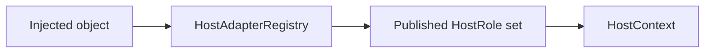
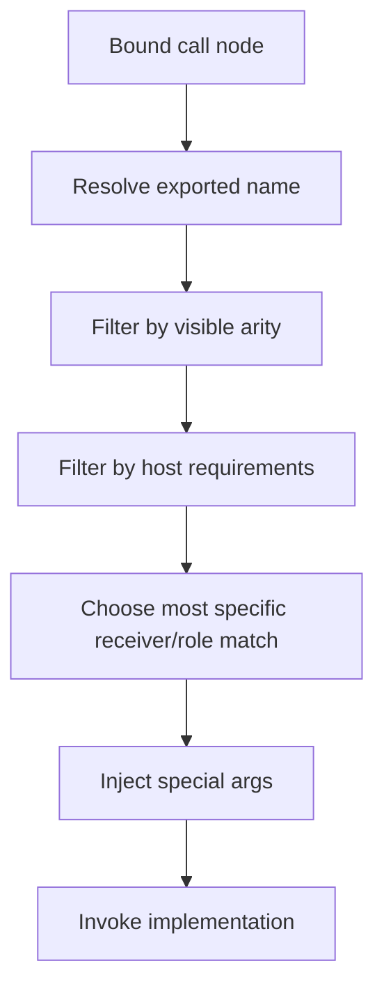

# Host Injection API Draft

## Purpose
- This document refines the host-side part of `molang-ast-and-semantics-draft.md`.
- It defines the draft API shape and resolution rules for:
  - `MolangScope.host`,
  - receiver-first host callables,
  - typed host publication,
  - ambiguity handling,
  - migration away from `MolangOwnerSet`-style lookup.

## Relationship To Other Docs
- `molang-syntax-baseline.md` defines what syntax is accepted.
- `molang-ast-and-semantics-draft.md` defines the high-level semantic split between Molang values and host runtime.
- `shared-vocabulary-and-phase-ownership-draft.md` defines the canonical vocabulary and ownership boundaries used here.
- This document only defines the **host injection contract**.

## Repository Boundary Reminder
- Engine-side abstractions belong in `molang` package.
- Minecraft/Forge objects may appear as examples here, but platform-specific publication and lifecycle wiring still belong in root `src/main/java/io/github/tt432/eyelib/mc/impl/molang/**`.
- This document does not authorize moving platform bindings into `molang` package.

---

## 1. Problem Statement

## 1.1 Current weakness
- Current `MolangScope` mixes value state with host object lookup.
- `MolangOwnerSet` is effectively a heterogeneous object bag with `Class.isInstance`-based search.
- This creates several problems:
  - insertion-order sensitivity,
  - weak diagnostics,
  - poor cacheability,
  - no explicit role model,
  - difficult overload and inheritance semantics.

## 1.2 Target outcome
- A caller should be able to provide host objects/services to the scope.
- Host-backed Molang callables should receive typed objects automatically.
- The resolution model must stay deterministic and analyzable.

---

## 2. Core Design Rules

### Rule A: separate Molang values from host context
- `scope.values` serves `variable/temp/context/...` semantics.
- `scope.host` serves typed host publication and injection.

### Rule B: receiver-first is the default authoring model
- For host-bound callables, the first host parameter is the receiver/subject.
- Remaining user-visible parameters are Molang arguments.
- Receiver inference stays bounded. The first non-special host parameter may infer `RECEIVER` only when the declaration is otherwise unambiguous. `INJECTED_HOST` and `SPECIAL_ENGINE_ARG` always require explicit metadata.

### Rule C: explicit roles still exist internally
- Receiver type alone is not enough in all cases.
- Internal dispatch may require explicit published host roles for ambiguous or multi-object scenarios.

### Rule D: raw-class lookup is not the semantic contract
- Java `Class<?>` is a publication aid, not the user-visible contract.
- Stable internal dispatch should operate on explicit published host roles.

---

## 3. Proposed Runtime Surface

```text
MolangScope
├── values : MolangValueContext
└── host   : HostContext
```

## 3.1 Draft interfaces

```java
interface HostContext {
    <T> void put(HostRole<T> role, T value);
    <T> Optional<T> get(HostRole<T> role);
    boolean contains(HostRole<?> role);
    HostShape shape();
}

interface HostRole<T> {
    String id();
    Class<T> rawType();
}

interface HostShape {
    Set<HostRole<?>> roles();
}
```

## 3.2 Naming guidance
- Use `HostRole` as the canonical design term.
- If an implementation later introduces a storage-specific `HostKey`, treat it as an implementation carrier for a `HostRole`, not as a second semantic model.
- Reason: host publication is not the same concept as Molang value kinds.

---

## 4. Publication Model

## 4.1 Host adapter registry
- Host objects should be normalized into stable published roles via adapters.
- Adapters are the only place where inheritance is consulted.



## 4.2 Example
- Publishing a `LivingEntity` may result in:
  - `ENTITY`
  - `LIVING_ENTITY`
  - optionally `SELF_ENTITY` if publication site says that is the role

## 4.3 Why publication must be explicit
- It centralizes inheritance handling.
- It gives deterministic shape-based caching.
- It prevents runtime semantic lookup from wandering through Java class graphs.

---

## 5. Receiver-First Callable Model

## 5.1 Intent
- Default host-backed callable authoring should look conceptually like:

```text
health(self: LivingEntity)
distance_from_camera(self: Entity)
```

- The receiver is not a normal Molang-visible argument.
- It is injected from `HostContext`.

## 5.2 Parameter kinds
- A callable descriptor should distinguish at least four parameter kinds:
  1. `RECEIVER`
  2. `VISIBLE_ARG`
  3. `INJECTED_HOST`
  4. `SPECIAL_ENGINE_ARG`

## 5.3 Draft descriptor shape

```java
record HostCallableDescriptor(
    String exportedName,
    List<ParameterSpec> parameters,
    CallableTraits traits,
    Object implementationHandle
) {}

enum ParameterKind {
    RECEIVER,
    VISIBLE_ARG,
    INJECTED_HOST,
    SPECIAL_ENGINE_ARG
}
```

## 5.4 Resolution meaning
- `RECEIVER`: the primary host subject of the callable.
- `VISIBLE_ARG`: supplied by Molang call syntax.
- `INJECTED_HOST`: not user-visible, but still host-resolved.
- `SPECIAL_ENGINE_ARG`: scope/evaluation internals only.

---

## 6. Visible Argument Policy

## 6.1 Conservative first-stage policy
- For early drafts, visible Molang arguments should stay narrow and predictable:
  - number
  - boolean
  - string
  - optionally `MolangObject` as an escape hatch

## 6.2 What should not happen by default
- Arbitrary Java host objects should not flow through visible call arguments.
- Host objects should arrive via receiver/injection, not normal Molang argument passing.

## 6.3 Why this matters
- It keeps the Molang/host boundary understandable.
- It improves binder diagnostics and dispatch stability.

---

## 7. Ambiguity And Role Handling

## 7.1 Why receiver type is not enough
- Cases like `self Entity` vs `target Entity` need stronger naming than raw class.
- Some runtime services have no natural receiver at all.

## 7.2 Recommended rule
- External authoring defaults to receiver-first.
- Internal registry may still require explicit published host roles.

## 7.3 Example

```text
look_at(self: Entity, target: ???)
```

This should not become “second host object as visible arg” by accident.
Instead, the design should prefer either:
- an explicit injected role like `TARGET_ENTITY`, or
- a different query shape that makes the roles unambiguous.

---

## 8. Resolution Algorithm Draft



## 8.1 Deterministic ordering
- Candidate filtering order should be fixed:
  1. exported name
  2. visible arity
  3. visible argument compatibility
  4. required host role availability
  5. specificity/priority tie-break

## 8.2 Bounded inference rule
- Discovery may infer `RECEIVER` only from the first non-special host parameter when no explicit receiver is present and the role is otherwise unambiguous.
- Discovery must fail if more than one host candidate exists, if special arguments are not explicitly marked, or if the declaration would need guessing to determine parameter roles.

## 8.3 Hard rule
- Ties are design/configuration errors.
- Runtime should not guess between equally valid candidates.

---

## 9. Inheritance Handling

## 9.1 Where inheritance belongs
- Inheritance belongs in publication, not in call-site lookup.

## 9.2 Example
- If a `Player` is published, an adapter may declare:
  - `ENTITY`
  - `LIVING_ENTITY`
  - `PLAYER`

- Later callable resolution only sees the published role set.
- Later callable resolution only sees the published role set and `HostShape`; it does not inspect raw owner bags.

## 9.3 Why this is better
- It is cacheable.
- It avoids insertion-order bugs.
- It makes subtype handling testable without relying on Java reflection search behavior.

---

## 10. Diagnostics

## 10.1 Missing receiver
- If a callable requires `LIVING_ENTITY` and none is published, binder/runtime diagnostics should say that directly.

## 10.2 Ambiguous publication
- If two adapters publish the same exclusive role, this should fail loudly.

## 10.3 Unsupported visible args
- If a callable advertises only scalar visible args, a non-scalar Molang argument should fail with an explicit compatibility error.

---

## 11. Compatibility With Current Engine

## 11.1 Transitional stance
- `MolangOwnerSet` may remain temporarily as a compatibility layer.
- It should not remain the long-term semantic contract.

## 11.2 Migration direction
- old owner bag -> adapter publication -> `HostContext`
- scope-first helper methods -> descriptor-based injection

## 11.3 Explicit non-goal
- This draft does not try to preserve `ownerAs(Class)` as the future core API.

---

## 12. Open Questions
- Should `MolangObject` be allowed as a visible escape hatch in v1, or deferred until the rest of the model stabilizes?
- Which host roles are universal engine concepts versus module-local extension points?
- Which published host roles are universal engine concepts versus module-local extension points?

## 13. Decision Record
- Parameter-role inference is bounded. Explicit metadata is required for injected host and special engine arguments, and receiver inference is only allowed for the first non-special host parameter when it is unambiguous.

## 13. Immediate Follow-Up
- query variant registry draft
- callable discovery/annotation draft
- host adapter registry draft
