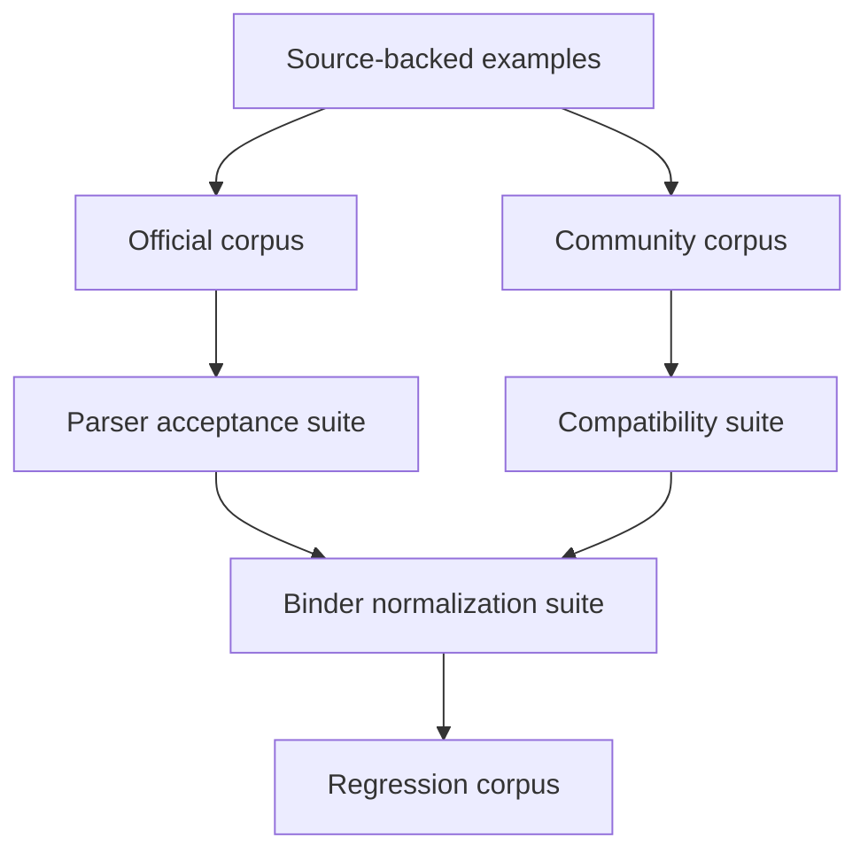

# Parser Acceptance Corpus

## Purpose
- This document turns the syntax baseline and compatibility matrix into a concrete acceptance corpus for future implementation.
- It is intended to validate:
  - lexer behavior,
  - parser acceptance/rejection,
  - binder normalization,
  - selected runtime/compatibility expectations where syntax alone is insufficient.

## Relationship To Other Docs
- `molang-syntax-baseline.md` defines the accepted syntax surface and source-backed examples.
- `compatibility-semantics-matrix.md` defines which behaviors are required, targeted, deferred, or isolated in compatibility policy.
- This document converts those decisions into a testable corpus shape.

## Repository Boundary Reminder
- This is a design-time test corpus specification.
- It does not prescribe a specific parser implementation strategy.

---

## 1. Corpus Philosophy

### 1.1 Why a corpus exists
- Public Molang documentation is example-heavy and not fully formalized.
- The rewrite therefore needs an executable acceptance standard, not just architecture prose.

### 1.2 Corpus layering
- The corpus should be split into evidence-driven layers:
  1. official syntax/behavior corpus
  2. community compatibility corpus
  3. internal regression corpus

### 1.3 Assertion types
- Each corpus case should declare one or more assertion types:
  - `lex-accept`
  - `parse-accept`
  - `parse-reject`
  - `bind-normalize`
  - `compat-behavior`
  - `deferred-note`

---

## 2. Test Case Metadata Draft

```yaml
id: official.simple-expression.sin
source: "math.sin(query.anim_time * 1.23)"
evidence: official
layer: official
assertions:
  - parse-accept
  - bind-normalize
notes:
  - query alias normalization not involved
```

## 2.1 Suggested metadata fields
- `id`: stable case identifier
- `source`: Molang source snippet
- `layer`: official / community / internal
- `evidence`: official / community / implementation-survey / internal
- `assertions`: expected validation categories
- `expected-shape`: optional parse/bind shape summary
- `compatibility-posture`: required / targeted / deferred
- `notes`: rationale or caveats

---

## 3. Official Corpus

## 3.1 Simple expression

### Case: `official.simple-expression.sin`
```text
math.sin(query.anim_time * 1.23)
```
- Assertions:
  - `parse-accept`
  - `bind-normalize`
- Expected shape:
  - call expression
  - member/root access for `query.anim_time`
  - binary multiplication inside call arg

## 3.2 Statement sequence + return

### Case: `official.complex.assign-return`
```text
variable.is_blinking = 1; variable.return_from_blink = query.life_time; return query.all_animations_finished && (query.life_time > (variable.return_from_blink ?? 0.2));
```
- Assertions:
  - `parse-accept`
  - `bind-normalize`
- Expected shape:
  - statement list
  - assignment targets are member chains
  - final `return`
  - `??` nested inside comparison/logical expression

## 3.3 Ternary + array index

### Case: `official.ternary.array-index`
```text
query.get_name == 'Toast' ? Texture.toast : Array.skins[query.variant]
```
- Assertions:
  - `parse-accept`
  - `bind-normalize`
- Expected shape:
  - conditional expression
  - single-quoted string literal
  - indexed access on `Array.skins`

## 3.4 Loop block

### Case: `official.loop.block`
```text
loop(10, {
    t.x = v.x + v.y;
    v.x = v.y;
    v.y = t.x;
});
```
- Assertions:
  - `parse-accept`
  - `bind-normalize`
- Expected shape:
  - dedicated `LoopStmt` / loop control-form node
  - block body with statement list
  - alias normalization `t` -> `temp`, `v` -> `variable`

## 3.5 Break inside loop body

### Case: `official.loop.break`
```text
loop(10, {t.x = v.x + v.y; v.x = v.y; v.y = t.x; (v.y > 20) ? break;});
```
- Assertions:
  - `parse-accept`
  - `bind-normalize`
  - `compat-behavior`
- Notes:
  - exact control-flow semantics should also be validated at runtime layer

## 3.6 Struct/member/arrow access

### Case: `official.struct.arrow`
```text
v.location.x = 1;
v.location.y = 2;
v.location.z = 3;
v.another_mobs_location = v.another_mob_set_elsewhere->v.location;
```
- Assertions:
  - `parse-accept`
  - `bind-normalize`
- Expected shape:
  - chained member access
  - distinct arrow access node/operator

## 3.7 Deep arrow chain

### Case: `official.deep-arrow-chain`
```text
v.cowcow.friend = v.pigpig; v.pigpig->v.test.a.b.c = 1.23; return v.cowcow.friend->v.test.a.b.c;
```
- Assertions:
  - `parse-accept`
  - `bind-normalize`
  - `compat-behavior`
- Notes:
  - important for proving the parser does not collapse chains into one dotted token

## 3.8 Null coalescing

### Case: `official.null-coalesce`
```text
variable.rolled_up_time = variable.is_rolled_up ? ((variable.rolled_up_time ?? 0.0) + query.delta_time) : 0.0;
```
- Assertions:
  - `parse-accept`
  - `bind-normalize`

## 3.9 for_each

### Case: `official.for-each`
```text
for_each(t.pig, query.get_nearby_entities(4, 'minecraft:pig'), {
    v.x = v.x + 1;
});
```
- Assertions:
  - `parse-accept`
  - `bind-normalize`
  - `compat-behavior`
- Expected shape:
  - dedicated `ForEachStmt` / for-each control-form node
  - block body with statement list
  - binder preserves the control form instead of reclassifying a generic call

---

## 4. Community Compatibility Corpus

## 4.1 Alias-heavy expression

### Case: `community.aliases.delta-time`
```text
v.buff_timer = (v.buff_timer ?? 0) + q.delta_time;
```
- Assertions:
  - `parse-accept`
  - `bind-normalize`
- Compatibility posture:
  - Required for alias normalization

## 4.2 Zero-arg query omission

### Case: `community.zero-arg-query-omission`
```text
query.is_invisible
```
- Assertions:
  - `parse-accept`
  - `compat-behavior`
- Compatibility posture:
  - Targeted
- Notes:
  - runtime/binder may normalize this into a callable/query-access form later

## 4.3 temp struct warning case

### Case: `community.temp-struct-restriction`
```text
temp.location.x = 1;
```
- Assertions:
  - `parse-accept`
  - `deferred-note`
- Compatibility posture:
  - Targeted
- Notes:
  - syntax should parse; compatibility layer decides whether runtime rejects or warns

## 4.4 Arrow short-circuit expectation

### Case: `community.arrow-short-circuit`
```text
context.other->query.remaining_durability
```
- Assertions:
  - `parse-accept`
  - `compat-behavior`
- Compatibility posture:
  - Required

## 4.5 Repeated arrow chain caution

### Case: `community.multi-arrow-caution`
```text
a->b->c
```
- Assertions:
  - `parse-accept`
  - `deferred-note`
- Compatibility posture:
  - Deferred
- Notes:
  - parser should likely accept chained arrow syntax; semantic restriction remains policy-dependent until better evidence exists

---

## 5. Negative / Rejection Corpus

## 5.1 Unterminated string

### Case: `reject.unterminated-string`
```text
'abc
```
- Assertions:
  - `parse-reject`

## 5.2 Invalid binary sequence

### Case: `reject.double-operator`
```text
query.anim_time + * 2
```
- Assertions:
  - `parse-reject`

## 5.3 Broken member chain

### Case: `reject.dangling-dot`
```text
variable.
```
- Assertions:
  - `parse-reject`

## 5.4 Broken index expression

### Case: `reject.unclosed-index`
```text
Array.skins[query.variant
```
- Assertions:
  - `parse-reject`

---

## 6. Binder Normalization Corpus

## 6.1 Alias canonicalization

### Case: `bind.alias-canonicalization`
```text
q.life_time + t.counter + v.timer + c.foo
```
- Assertions:
  - `parse-accept`
  - `bind-normalize`
- Expected bind summary:
  - `q` -> `query`
  - `t` -> `temp`
  - `v` -> `variable`
  - `c` -> `context`

## 6.2 Access-family preservation

### Case: `bind.access-family-preservation`
```text
v.friend->v.location.x
```
- Assertions:
  - `parse-accept`
  - `bind-normalize`
- Expected bind summary:
  - preserve distinction between `->` and `.` in semantic tree

## 6.3 Query candidate normalization

### Case: `bind.query-candidate`
```text
query.swell_amount
```
- Assertions:
  - `parse-accept`
  - `bind-normalize`
- Expected bind summary:
  - normalize into a query-backed semantic node/candidate set, not a generic unresolved identifier chain

---

## 7. Runtime / Compatibility-Focused Corpus

## 7.1 Array index conversion

### Case: `compat.array-index-float`
```text
Array.test[1.8]
```
- Assertions:
  - `parse-accept`
  - `compat-behavior`
- Compatibility posture:
  - Required

## 7.2 Neutral-fallback query behavior

### Case: `compat.query-default-neutral`
```text
query.some_missing_or_non_applicable_feature
```
- Assertions:
  - `parse-accept`
  - `compat-behavior`
  - `deferred-note`
- Compatibility posture:
  - Targeted
- Notes:
  - exact result should be policy-driven and query-family-aware

## 7.3 Version-sensitive ternary behavior marker

### Case: `compat.ternary-version-sensitive`
```text
a ? b : c ? d : e
```
- Assertions:
  - `parse-accept`
  - `deferred-note`
- Compatibility posture:
  - Targeted
- Notes:
  - exact associativity expectations may be version-policy-dependent

---

## 8. Corpus Organization Recommendation



## 8.1 File-level suggestion
- Future executable corpus may be organized as:
  - `official/*.molang`
  - `community/*.molang`
  - `reject/*.molang`
  - `bind/*.molang`
  - `compat/*.molang`

## 8.2 Naming rule
- Test IDs should remain stable even if filenames move.

---

## 9. Gaps And Future Expansion

## 9.1 Still-needed corpus areas
- string edge cases / escaping
- case-insensitivity normalization
- comment handling if adopted
- host/query registry integration examples
- compatibility-policy-specific runtime fixtures

## 9.2 Internal regression layer
- Once implementation begins, every bug fix should add a corpus case with:
  - source snippet
  - expected assertion kind
  - bug reference or rationale

---

## 10. Open Questions
- Should parser acceptance and binder normalization live in one corpus format, or two adjacent formats?
- How much expected-shape detail should be encoded directly in the corpus versus in separate golden files?
- Do we want explicit “strict mode” expected outcomes alongside compatibility-mode expected outcomes for some cases?

## 11. Immediate Follow-Up
- parser strategy draft
- strict/debug diagnostics mode draft
- executable corpus format draft
