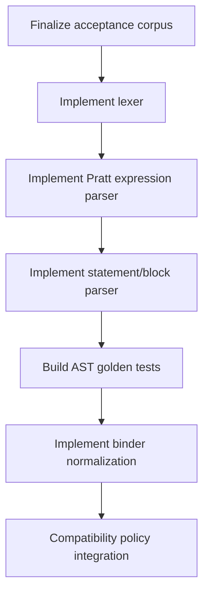

# Parser Strategy Draft

## Purpose
- This document turns the syntax baseline, compatibility matrix, and parser acceptance corpus into a concrete frontend strategy.
- It answers:
  - what parsing style the rewrite should use,
  - what belongs in the lexer vs parser vs binder,
  - how statements and expressions should be split,
  - how to handle postfix access chains and precedence-sensitive operators,
  - how errors and recovery should behave.

## Relationship To Other Docs
- `molang-syntax-baseline.md` defines the accepted syntax surface.
- `parser-acceptance-corpus.md` defines what the frontend must accept/reject and normalize.
- `compatibility-semantics-matrix.md` defines which quirks belong outside the core parser.
- `molang-ast-and-semantics-draft.md` defines the AST shape the parser should target.

## Repository Boundary Reminder
- This document defines parser strategy only.
- It does not re-open engine/platform ownership or generated-code policy.

---

## 1. Core Recommendation

### 1.1 Recommended style
- Use a **handwritten lexer + recursive descent for statement/block structure + Pratt parser (or equivalent precedence-climbing parser) for expressions**.

### 1.2 Why this is the recommended strategy
- Molang is small enough for a handwritten frontend.
- Public documentation is descriptive and example-driven, not formal grammar-driven.
- The acceptance corpus is more important than preserving a declarative grammar asset.
- Expression syntax contains precedence-sensitive operators and postfix chaining that are more naturally expressed with Pratt-style parsing than with a “pure LL(k) grammar” presentation.

### 1.3 Short answer on LL(k)
- A strongly LL-flavored implementation is still viable.
- Statement/block structure is comfortably recursive-descent.
- The awkward part is expression grammar: `?:`, `??`, assignment, postfix chaining, and access-family composition make a strict textbook LL(k) grammar less pleasant than a Pratt parser.
- Therefore the best practical answer is:
  - **LL-style outer parser**,
  - **Pratt-style inner expression parser**.

---

## 2. Frontend Layering

```mermaid
flowchart LR
    A[Source text] --> B[Lexer]
    B --> C[Statement parser]
    C --> D[Expression parser (Pratt)]
    D --> E[AST]
    E --> F[Binder]
```

## 2.1 Lexer owns
- case-insensitive tokenization for identifiers/keywords/operators where appropriate
- single-quoted string tokenization
- numeric literal tokenization
- punctuation/operator tokenization
- trivia capture policy if diagnostics/comments later matter

## 2.2 Statement parser owns
- statement lists
- brace blocks
- `return`
- `break`
- `continue`
- loop-like and `for_each` statement/expression container parsing

## 2.3 Expression parser owns
- precedence and associativity
- prefix/unary forms
- calls
- member/index/arrow postfix chaining
- assignment and conditional structure

## 2.4 Binder owns
- alias normalization (`q/t/v/c`)
- query/call normalization
- host/query semantic projection
- compatibility-policy-sensitive semantic decisions that should not be embedded in the parser

---

## 3. Lexer Strategy

## 3.1 Token categories
- identifiers
- number literals
- string literals
- punctuation delimiters: `(` `)` `{` `}` `[` `]` `,` `;` `.`
- operators: `+` `-` `*` `/` `%` `!` `&&` `||` `==` `!=` `<` `<=` `>` `>=` `=` `?` `:` `??` `->`
- keywords/special words: `return`, `break`, `continue`, possibly special loop forms depending on final grammar treatment

## 3.2 Case-insensitivity policy
- Token identity for identifiers/keywords should be case-insensitive.
- String literal contents must preserve exact case.

## 3.3 String policy
- The lexer should support only the documented single-quoted string form in the first implementation.
- Escape behavior should remain narrow and source-backed.

## 3.4 Do not over-encode semantics in tokens
- Avoid tokenizing dotted names like `query.life_time` as one token.
- Dots and arrows must remain explicit tokens so chained access stays structural.

---

## 4. Statement Parsing Strategy

## 4.1 Top-level parse shape
- Parse the top-level as either:
  - a simple expression, or
  - a complex expression body represented as a statement list / block-oriented form.

## 4.2 Statement kinds
- expression statement
- return statement
- break statement
- continue statement
- block statement
- loop / for_each body-bearing forms

## 4.3 Why statement parsing should stay simple
- Statement grammar is relatively small.
- Most syntactic complexity lives inside expressions, not statement dispatch.

---

## 5. Expression Strategy

## 5.1 Prefix / infix / postfix split
- The Pratt parser should separate operators into:
  - prefix forms
  - infix forms
  - postfix forms

## 5.2 Postfix access family
- Postfix parsing should treat these as a chainable family:
  - member access `.`
  - arrow access `->`
  - index access `[]`
  - call suffix `()`

### Example
```text
v.pigpig->v.test.a.b.c
```

Should parse as a left-growing postfix chain, not through special-case dotted token handling.

## 5.3 Recommended operator tiers
Recommended practical precedence tiers:

1. postfix: `.`, `->`, `[]`, call
2. prefix unary
3. multiplicative
4. additive
5. comparisons / equality
6. logical conjunction / disjunction
7. null coalescing `??`
8. conditional `?:`
9. assignment `=`

The exact table should remain validated against the acceptance corpus and official/community behavior.

## 5.4 Right-associative operators
- Conditional `?:`, null-coalescing if required by final semantics, and assignment are the most likely right-associative/problematic operators.
- This is one of the main reasons a Pratt parser is preferable here.

---

## 6. Special Forms And Ambiguous Constructs

## 6.1 `loop` and `for_each`
- Treat them as parser-recognized forms that still fit into the AST/statement model cleanly.
- Resolve them as dedicated parser productions with dedicated control-form AST nodes.
- Even though they use paren syntax, they should be handled by the statement/block parser rather than by the generic `CallExpr` path and lowered later.
- The key requirement is preserving their control-flow role clearly in the AST before binder or runtime phases begin.

## 6.2 Zero-arg query omission
- The parser may initially produce a generic access node for `query.foo`.
- Binder/runtime normalization can later decide whether that node behaves like a zero-arg query call.
- This avoids overloading the parser with host/query semantics.

## 6.3 `temp.` struct restrictions
- Parse generically.
- Leave any restriction to compatibility policy, not syntax.

---

## 7. Assignment Parsing

## 7.1 Accepted target forms
- identifier target
- member target
- arrow-member target where semantically allowed
- indexed target if enabled by acceptance corpus and later semantics

## 7.2 Parser rule
- The parser should not decide whether an assignment target is semantically writable in all cases.
- It should build a syntactic assignment node when the left-hand side is structurally assignment-capable enough, and let binder/semantic validation reject invalid write targets later.

---

## 8. Error Recovery Strategy

## 8.1 Parser goals
- good diagnostics for malformed content
- ability to recover enough structure for editor tooling where possible
- no silent reinterpretation of clearly invalid syntax

## 8.2 Recovery anchors
- Recommended recovery anchors:
  - `;`
  - `}`
  - end-of-input

## 8.3 Error policy
- In batch/compile mode, prefer explicit failure.
- In editor/incremental mode, preserve partial AST where practical.

---

## 9. Incremental And Tooling Considerations

## 9.1 Source spans
- Every AST node should retain stable source span information.

## 9.2 Why spans matter
- diagnostics
- formatter support if added later
- corpus-based golden tests
- binder/runtime error reporting

## 9.3 Comment handling
- Comment syntax is not part of the current required baseline.
- If comments are supported later, they should remain trivia rather than semantic syntax.

---

## 10. Binder Handoff Contract

## 10.1 Parser output must preserve
- exact operator distinction between `.` and `->`
- assignment target structure
- block and statement ordering
- literal values and source text spans
- enough shape to distinguish call/access/index chains

## 10.2 Parser output must not embed
- alias normalization
- query-specific callable semantics
- host injection rules
- subtype/query variant dispatch
- compatibility fallbacks like neutral defaults

This is the critical parser/binder boundary.

---

## 11. Why Not Keep ANTLR As The Main Strategy

## 11.1 Not a pure tooling objection
- ANTLR is not rejected because it is incapable.
- It is rejected as the primary design center because the real source of truth here is an evolving acceptance corpus and compatibility matrix, not a stable formal grammar specification.

## 11.2 Practical downside
- Expression and compatibility evolution would still force semantic complexity outside the grammar.
- The team would still need to own the grammar asset long-term.
- The new strategy keeps the core closer to the actual evidence sources and test corpus.

---

## 12. Recommended Implementation Sequence



## 12.1 Order rationale
- Expressions are the hardest part; solve them with the corpus in hand.
- Statement parsing is comparatively straightforward once expression parsing is stable.
- Binder and compatibility should consume a stable AST, not drive parser design prematurely.

---

## 13. Open Questions
- Should `loop` and `for_each` be parsed as call-surface syntax lowered later, or as dedicated parser productions from the start?
- Do we want one Pratt table for all expression contexts, or small mode variations for restricted contexts?
- How much recovery/incrementality matters in v1 versus a compile-only parser?

## 14. Immediate Follow-Up
- strict/debug diagnostics mode draft
- executable corpus format draft
- binder normalization contract draft
