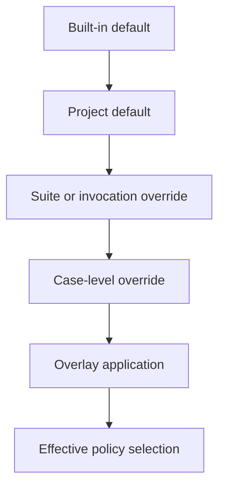

# Policy Pack Selection / Configuration Draft

## Purpose
- This document defines how compatibility policy packs are selected, configured, and overridden in practice.
- It refines the `compatibility-policy-pack-draft.md` selection section into a concrete contract.

## Relationship To Other Docs
- `compatibility-policy-pack-draft.md` defines what policy packs are.
- `shared-vocabulary-and-phase-ownership-draft.md` defines base-pack versus diagnostics-overlay ownership.
- `strict-debug-diagnostics-mode-draft.md` defines diagnostic modes that may interact with pack selection.
- `corpus-linter-runner-draft.md` and `executable-corpus-format-draft.md` define test-time pack selection requirements.

## Repository Boundary Reminder
- This document covers engine-side configuration semantics.
- It does not define application/CLI/UI configuration surfaces in final detail.

---

## 1. Configuration Goals

### 1.1 Must support
- explicit pack selection
- documented default pack behavior
- deterministic precedence when multiple configuration sources exist
- test harness overrides
- diagnostics overlays without semantic confusion

### 1.2 Must avoid
- hidden global guessing
- implicit mixing of unrelated policy packs
- environment-dependent behavior that is hard to reproduce in tests

---

## 2. Selection Sources

Possible sources, from strongest to weakest intent:

1. explicit runtime invocation / API parameter
2. corpus-case metadata override
3. test-suite default configuration
4. project/application default
5. engine built-in fallback default

---

## 3. Precedence Rule

## 3.1 Recommended precedence
- Highest-precedence explicit source wins.
- Only one concrete base policy pack should be active at a time unless the system later supports explicit layering.

## 3.2 Draft rule
- If multiple sources disagree at the same precedence level, configuration should fail loudly.

---

## 4. Draft Configuration Shape

```java
record PolicyPackSelection(
    String packId,
    String source,
    boolean strictOverlay,
    boolean debugOverlay,
    Map<String, Object> options
) {}
```

Exact runtime shape remains open.

---

## 5. Base Pack vs Overlay Model

## 5.1 Recommended model
- Separate:
  - **base semantic pack**
  - **diagnostic overlays**

## 5.2 Why this is preferable
- A compatibility pack should describe semantic behavior.
- Strict/debug behavior should mostly remain overlays, not entirely separate semantic packs, unless behavior truly diverges.
- Overlay selection should not become a second hidden policy-pack chooser.

## 5.3 Example
- `compatibility-v1` + strict overlay
- `minimal-v1` + debug overlay

---

## 6. Corpus/Test Integration

## 6.1 Case-level override
- Corpus cases may name a pack explicitly.
- This should override suite defaults.

## 6.2 Suite-level default
- Test suites may define a default pack to reduce repetition.

## 6.3 Reproducibility rule
- Every executed case report must record the final effective pack selection and diagnostics-overlay state.

---

## 7. Failure Modes

## 7.1 Unknown pack
- Error.

## 7.2 Ambiguous configuration
- Error.

## 7.3 Unsupported option for selected pack
- Error in strict configuration parsing, not silent ignore.

---

## 8. Suggested Resolution Flow



---

## 9. Open Questions
- Should pack options be strongly typed per pack, or one generic option bag with validation?
- Do we want future pack layering, or should v1 forbid it entirely?
- How much overlay behavior should be cached into the effective selection identity?

## 10. Immediate Follow-Up
- corpus reporter/output format draft
- specialization cache contract draft
- configuration schema draft
