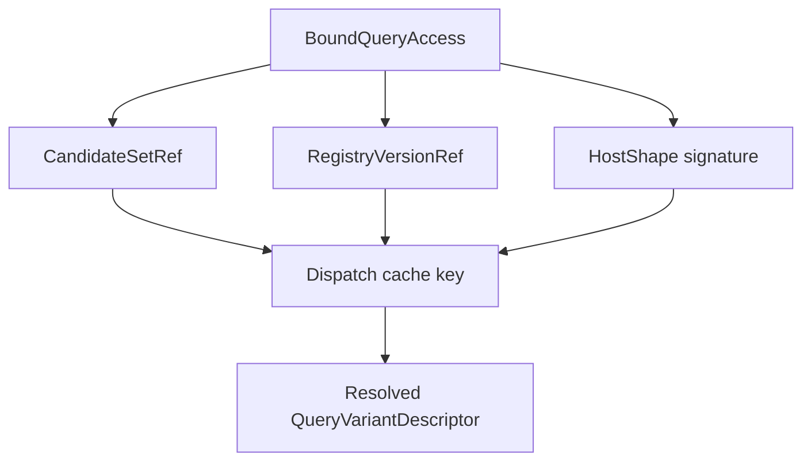

# Query Variant Registry Draft

## Purpose
- This document refines the query dispatch part of `molang-ast-and-semantics-draft.md`.
- It defines a draft registry and selection model for host-backed query variants.

## Relationship To Other Docs
- `host-injection-api-draft.md` defines how host context is published.
- `shared-vocabulary-and-phase-ownership-draft.md` defines the canonical meaning of `HostRole`, `VisibleArgSpec`, `BoundQueryAccess`, and specialization ownership.
- This document defines how host-backed queries consume that published context.

## Repository Boundary Reminder
- Query registry contracts may live in `:eyelib-molang`.
- Minecraft-specific query implementations and lifecycle wiring still belong in root-side platform modules unless explicitly extracted.

---

## 1. Problem Statement

## 1.1 Current weakness
- Current query behavior is effectively distributed across many hand-written methods plus runtime class checks.
- This makes subtype quirks and fallback chains hard to audit and hard to cache.

## 1.2 Target outcome
- Query dispatch should be explicit, deterministic, and inspectable.
- Different subtype-specific behaviors should become ordered variants of the same exported query.

---

## 2. Core Model

## 2.1 Variant definition
- A query variant is one callable candidate for one exported query name.
- Every variant should declare:
  - exported name,
  - visible argument signature,
  - required host roles,
  - traits,
  - implementation,
  - optional explicit priority.

## 2.2 Draft descriptor

```java
record QueryVariantDescriptor(
    String name,
    List<VisibleArgSpec> visibleArgs,
    Set<HostRole<?>> requiredRoles,
    CallableTraits traits,
    int priority,
    Object implementationHandle
) {}
```

`QueryVariantDescriptor` is a registry-facing projection derived from discovery output, not a second canonical declaration source.

---

## 3. Registry Shape


## 3.1 Lookup key
- First lookup key is exported query name.
- Second filter is visible argument arity/signature.
- Third filter is host-role availability.

## 3.2 Why a registry
- It makes the available query surface explicit.
- It allows offline diagnostics and documentation generation.
- It supports stable caching by host shape.

---

## 4. Selection Algorithm Draft

## 4.1 Candidate filtering order
1. match exported name
2. match visible arity
3. match visible argument compatibility
4. require all declared host roles to be present
5. choose highest specificity
6. use explicit priority only as a deterministic tie-break where allowed

## 4.2 Specificity meaning
- A variant requiring `PLAYER` is more specific than one requiring `LIVING_ENTITY`.
- A variant requiring `LIVING_ENTITY` is more specific than one requiring `ENTITY`.
- A variant requiring a strict role like `SELF_ENTITY` is more specific than one requiring generic `ENTITY`.

## 4.3 Hard rules
- Equal specificity + equal priority = registry error.
- Runtime should never silently guess.

---

## 5. Examples

## 5.1 `query.swell_amount`

```text
variant A: requires CREEPER
variant B: requires WITHER_BOSS
variant C: default -> 0
```

This models the behavior as query semantics instead of hidden runtime class fallback.

## 5.2 `query.is_charging`

```text
variant A: requires VEX
variant B: requires some more general flying/living role only if semantically valid
variant C: default -> false
```

## 5.3 `query.distance_from_camera`

```text
variant A: requires ENTITY + QUERY_RUNTIME
```

This makes the role boundary explicit: one role is the receiver, one role is a service.

---

## 6. Binding Integration

## 6.1 Binder output
- Binder should not directly choose a final subtype implementation in the general case.
- Binder should resolve query-surface usage into a registry-backed semantic node.

## 6.2 Bound form intent

```text
BoundQueryAccess
├── exportedName
├── visibleArgs
├── candidateSetRef
├── registryVersionRef
├── traits summary
└── querySurfaceKind
```

- `querySurfaceKind` preserves whether the source used omission-style access or explicit call spelling.
- Binder owns this node shape; the narrow link pass resolves the symbolic name to stable candidate-set and registry-version refs; specialization owns the final winner selection.

## 6.3 Why not finalize too early
- Available host roles may differ by runtime publication site.
- Full finalization may be shape-dependent.

---

## 7. Caching Model

## 7.1 Host shape cache key
- Dispatch should be cacheable by host shape, not by raw Java object identity.



## 7.2 Why shape-based caching
- It stays stable across object instances.
- It reflects the real dispatch contract.
- It avoids repeated reflection/class-hierarchy walking.

---

## 8. Trait Aggregation

## 8.1 Variant traits
- Each variant should carry the same trait family discussed earlier:
  - deterministic
  - runtime-enumerable
  - side-effect-free

## 8.2 Bound-call analysis
- If a call has multiple possible variants before shape specialization, analysis should be conservative.
- Example:
  - if any candidate is non-deterministic, pre-specialization analysis may need to treat the call as non-deterministic.

---

## 9. Default Variants

## 9.1 Why defaults matter
- Many Molang queries degrade to neutral values when data is unavailable.
- This behavior should be explicit in registry design rather than accidental.

## 9.2 Recommended pattern
- If a query has a neutral default, model it as an explicit lowest-specificity variant.
- Do not hide fallback behavior in ad hoc implementation code if it affects semantics broadly.

---

## 10. Error And Conflict Rules

## 10.1 Registration-time conflicts
- Two equal-priority, equal-specificity variants for the same query surface are invalid.

## 10.2 Runtime unresolved behavior
- If no variant matches, resolution should follow documented query semantics:
  - explicit default variant if declared,
  - otherwise a controlled unresolved path.

## 10.3 Documentation requirement
- Query packs should be able to enumerate their exported queries and their required host roles.

---

## 11. Migration From Current Query Code

## 11.1 Expected migration pattern
- Current hand-written query methods become explicit variant registrations.
- Existing fallback chains become ordered registry entries.
- Owner-set class scans disappear from semantic dispatch.
- The binder-to-link pass becomes the stable handoff between semantic projection and specialization.

## 11.2 Incremental adoption
- We do not need to migrate every query at once.
- Early migration can focus on high-value or high-ambiguity queries first.

---

## 12. Open Questions
- Should explicit priority be rare and mostly reserved for tie-breaks, or first-class in normal authoring?
- Which query families deserve separate registries versus one unified registry?

## 13. Decision Record
- Runtime specialization is preceded by a narrow bind-link pass. Binder projects semantics, the linker resolves symbolic names to stable candidate-set refs and registry version refs, and specialization chooses the final host-shape winner.

## 13. Immediate Follow-Up
- callable discovery/annotation draft
- compatibility semantics matrix
- parser acceptance corpus
