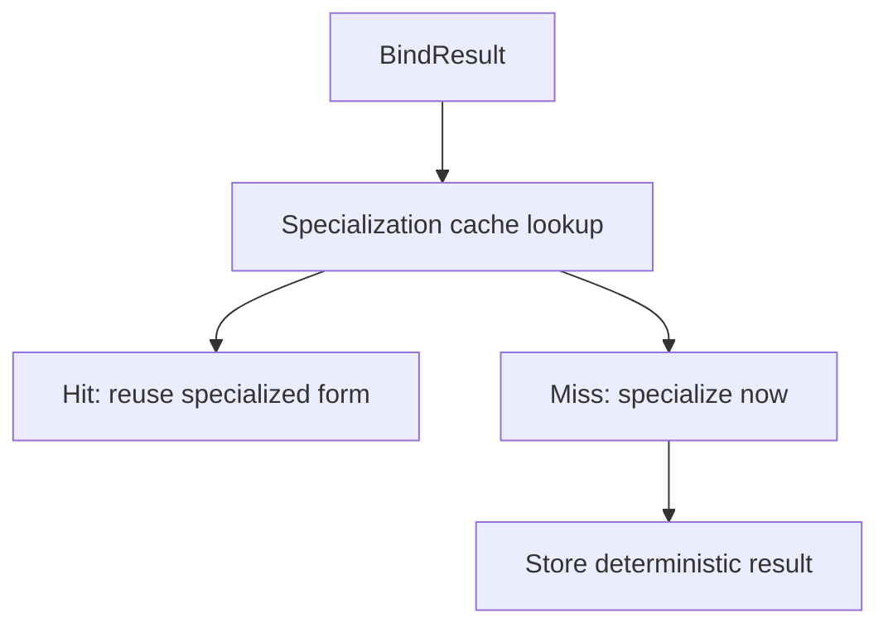

# Specialization Cache Contract Draft

## Purpose
- This document defines cache-key and invalidation rules for runtime specialization artifacts.
- It refines the caching section in `runtime-specialization-contract-draft.md`.

## Relationship To Other Docs
- `runtime-specialization-contract-draft.md` defines what specialization consumes and produces.
- `policy-pack-selection-configuration-draft.md` defines effective policy selection inputs.
- `shared-vocabulary-and-phase-ownership-draft.md` defines diagnostics overlay terminology.
- `strict-debug-diagnostics-mode-draft.md` explains why diagnostics mode can affect specialization results.

## Repository Boundary Reminder
- This is an engine-side cache contract.
- It does not prescribe the final cache storage implementation.

---

## 1. Why A Specialization Cache Exists

## 1.1 Motivation
- Specialization may repeatedly evaluate the same:
  - bind result
  - host shape
  - policy pack
  - diagnostics mode

## 1.2 Goal
- Reuse specialization results when semantics are identical.
- Avoid incorrect reuse when semantics differ in any visible way.

---

## 2. Cache-Key Inputs

Minimum semantic cache-key inputs:
- bind-result identity/version
- host shape signature
- effective policy-pack selection
- diagnostics overlay state

Optional future inputs:
- runtime feature flags
- engine semantic version

---

## 3. Draft Cache Key Shape

```java
record SpecializationCacheKey(
    Object bindKey,
    Object hostShapeKey,
    Object policySelectionKey,
    Object diagnosticsModeKey
) {}
```

---

## 4. Invalidation Rules

## 4.1 Must invalidate on
- bind result change
- host shape change
- selected policy pack change
- diagnostics overlay change

## 4.2 Why diagnostics mode is included
- Strict/debug may change outcome classification, emitted traces, or whether specialization is considered acceptable.

---

## 5. Cache Value Shape

```java
record CachedSpecialization(
    Object specializedRoot,
    List<MolangDiagnostic> diagnostics,
    Object summary
) {}
```

## 5.1 Recommended rule
- Cache the specialization result, not just the chosen variant ID.
- This keeps downstream consumers simple and preserves traceability.

---

## 6. Safety Rules

## 6.1 Never cache across semantic mismatch
- If any key dimension differs, do not reuse.

## 6.2 Ambiguous or failing specialization
- Caching failures is allowed only if the failure is deterministic for the exact same key.

## 6.3 Trace-sensitive caution
- Debug traces may include contextual detail.
- Decide whether debug payload is cached as part of the value or regenerated from cached summary data.

---

## 7. Suggested Cache Layers



---

## 8. Open Questions
- Should debug-mode specialization results share cache entries with normal/strict results if traces are regenerated lazily?
- How stable should bind-result identity be across incremental rebuilds?
- Do we want separate positive-result and failure-result cache policies?

## 9. Immediate Follow-Up
- configuration schema draft
- corpus diff/output UX draft
- incremental invalidation draft
