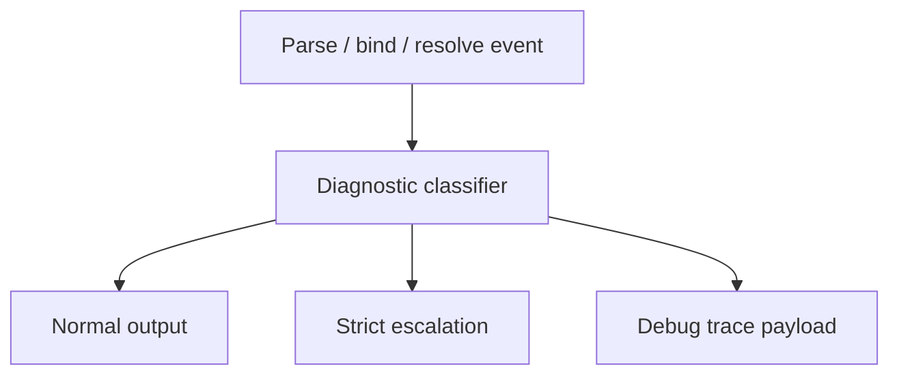

# Strict / Debug Diagnostics Mode Draft

## Purpose
- This document defines how the rewritten Molang engine should report problems and fallback behavior under different diagnostic modes.
- It connects parser, binder, compatibility policy, and runtime behavior into a coherent diagnostic contract.

## Relationship To Other Docs
- `parser-strategy-draft.md` defines parser error and recovery strategy.
- `compatibility-semantics-matrix.md` explicitly leaves room for stricter/debug behavior when compatibility policy would otherwise degrade results.
- `shared-vocabulary-and-phase-ownership-draft.md` defines diagnostics mode as an overlay over base semantic selection.
- `query-variant-registry-draft.md` and `host-injection-api-draft.md` define many of the resolution failures this document classifies.

## Repository Boundary Reminder
- This is an engine-side diagnostic policy draft.
- Platform-specific logging/telemetry wiring remains outside the scope of this document.

---

## 1. Why Modes Exist

## 1.1 Core problem
- Molang has a practical ecosystem where many failures degrade toward neutral values instead of surfacing loudly.
- That may be desirable in production compatibility mode, but it is bad for:
  - author debugging,
  - migration work,
  - rewrite validation,
  - test-case triage.

## 1.2 Goal
- Keep compatibility behavior available.
- Provide stricter and more transparent modes for development and debugging.
- Treat modes as overlays on top of base semantic policy selection, not as a second semantic pack system.

---

## 2. Proposed Modes

## 2.1 Normal mode
- Intended for default compatibility-oriented execution.
- Follows documented compatibility policy and neutral/default fallbacks where allowed.

## 2.2 Strict mode
- Intended for validation, testing, and migration.
- Converts selected fallback paths into diagnostics or hard failures.
- Refuses to silently accept ambiguous or weakly-supported behavior.

## 2.3 Debug mode
- Intended for deep inspection.
- Preserves normal/strict semantics as configured, but additionally emits structured reasoning/explanation data.

---

## 3. Diagnostic Categories

### Category A: Parse errors
- malformed syntax
- unterminated strings
- unclosed delimiters
- invalid operator sequences

### Category B: Bind errors
- unknown roots/identifiers where resolution is required
- invalid assignment targets
- incompatible callable argument layouts
- unresolved query/call normalization

### Category C: Host/query resolution issues
- missing receiver or required host role
- ambiguous receiver/role match
- no matching query variant
- conflicting adapter publication

### Category D: Compatibility-policy fallbacks
- neutral fallback result chosen
- compatibility-only behavior selected
- deferred/quirk-sensitive semantics encountered

### Category E: Analysis warnings
- partial evaluation skipped because of unresolved compatibility-sensitive semantics
- non-deterministic candidate set detected
- runtime-only construct blocks folding

---

## 4. Mode Matrix

| Situation | Normal mode | Strict mode | Debug mode |
|---|---|---|---|
| malformed syntax | error | error | error + trace |
| invalid assignment target | error | error | error + trace |
| alias normalization | silent normalize | silent normalize | normalize + note if tracing enabled |
| zero-arg query omission | allow if supported by policy | warn/error if policy says targeted only | explain normalization choice |
| neutral fallback query result | allowed where policy permits | warn or error depending on setting | explain fallback source |
| missing host role with explicit default variant | use default variant | configurable warn/error | explain why default variant won |
| missing host role with no default | unresolved error | unresolved error | unresolved error + resolution report |
| ambiguous host/variant match | error | error | error + candidate dump |
| deferred quirk encountered | tolerate if policy allows | warn/error | emit compatibility decision trace |
| partial-eval skipped due to compatibility uncertainty | silent or low-level note | warning | structured analysis note |

---

## 5. Parser Diagnostics Policy

## 5.1 Shared baseline
- Parser syntax errors are never silently accepted.
- Even in compatibility-oriented execution, malformed syntax is an error.

## 5.2 Recovery behavior
- Editor/incremental flows may recover partial AST.
- Compile/batch flows should treat parse errors as hard failures.

## 5.3 Debug additions
- In debug mode, parser diagnostics should include:
  - offending token/span
  - recovery anchor used
  - partial node context if recovery succeeded

---

## 6. Binder Diagnostics Policy

## 6.1 Hard failures
- Unknown or structurally invalid binding situations should be errors in all modes unless explicitly classified as compatibility-managed.

## 6.2 Compatibility-managed situations
- Some access or query forms may remain unresolved until compatibility policy/runtime specialization.
- Those should be represented explicitly rather than hidden.

## 6.3 Debug additions
- In debug mode, binder should be able to expose:
  - alias normalization steps
  - query/call normalization decisions
  - why a node stayed unresolved or shape-dependent

---

## 7. Host And Query Resolution Diagnostics

## 7.1 Missing receiver / missing host role
- Normal mode:
  - if a documented default path exists, allow it
  - otherwise error
- Strict mode:
  - allow only if explicitly policy-approved
  - otherwise emit warning/error instead of quiet fallback

## 7.2 Ambiguous match
- Ambiguity is always an error.
- No mode should silently guess.

## 7.3 Debug additions
- Debug mode should surface:
  - published host shape
  - candidate callables/variants
  - specificity comparison
  - final winner or failure reason

---

## 8. Compatibility Fallback Diagnostics

## 8.1 Neutral values
- If a neutral result is chosen due to compatibility policy, the engine should be able to say so.

## 8.2 Strict-mode intention
- Strict mode exists partly to catch places where compatibility behavior would otherwise hide incorrect assumptions.

## 8.3 Recommended rule
- Every compatibility fallback should be classifiable as one of:
  - explicit/defaulted behavior
  - tolerated unresolved behavior
  - deferred quirk behavior

---

## 9. Suggested Diagnostic Payload Shape

```java
record MolangDiagnostic(
    DiagnosticSeverity severity,
    DiagnosticPhase phase,
    String code,
    String message,
    Object sourceSpan,
    Map<String, Object> details
) {}
```

## 9.1 Recommended enums

```java
enum DiagnosticSeverity {
    INFO,
    WARNING,
    ERROR
}

enum DiagnosticPhase {
    LEXER,
    PARSER,
    BINDER,
    HOST_RESOLUTION,
    QUERY_RESOLUTION,
    COMPATIBILITY,
    ANALYSIS,
    RUNTIME
}
```

## 9.2 Why a structured payload matters
- Tests can assert diagnostics precisely.
- Debug tooling can render explanations consistently.
- Strict-mode behavior becomes predictable instead of ad hoc.

---

## 10. Debug Trace Model

## 10.1 Debug mode should not just log strings
- Prefer structured traces over free-form logging.

## 10.2 Draft trace examples
- parser recovery step trace
- alias normalization trace
- query variant candidate trace
- host publication trace
- compatibility fallback trace

## 10.3 Example flow



---

## 11. Testing Implications

## 11.1 Corpus expansion
- The parser acceptance corpus should eventually be extended with mode-aware expectations where relevant.

## 11.2 Suggested assertion additions
- `diagnostic-error`
- `diagnostic-warning`
- `debug-trace`
- `strict-mode-reject`

## 11.3 Why this matters
- Without mode-aware tests, strict/debug behavior will drift or become accidental.

---

## 12. Recommended First-Stage Scope

### 12.1 Must-have in v1
- structured parser/binder/runtime diagnostics
- ambiguity is always an error
- strict mode can elevate selected compatibility fallbacks
- debug mode can expose candidate/normalization/fallback traces

### 12.2 Good second wave
- user-configurable strictness per compatibility family
- richer debug visualization payloads
- policy-pack-aware diagnostics with version labels

---

## 13. Open Questions
- Should strict mode be one boolean, or a family of strictness flags?
- Should debug mode imply strict mode for some categories, or stay orthogonal?
- How much diagnostic payload should be retained in production-oriented execution to avoid overhead?

## 14. Immediate Follow-Up
- executable corpus format draft
- binder normalization contract draft
- compatibility policy pack draft
