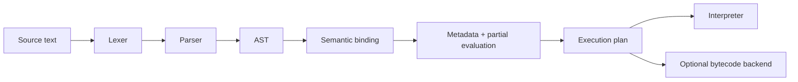
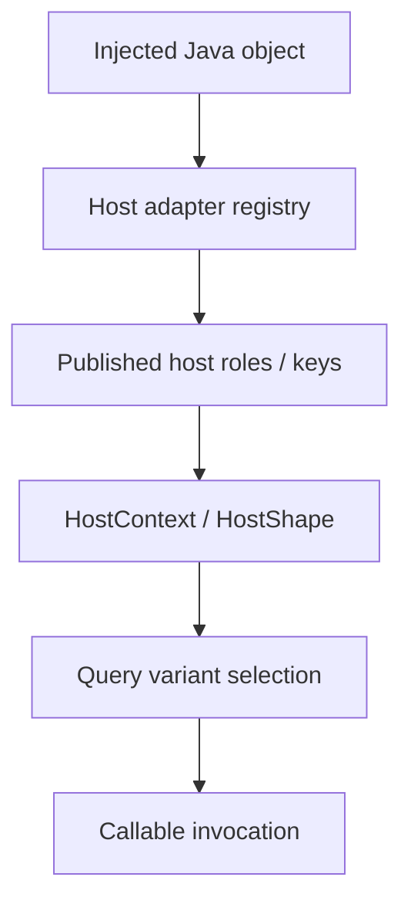

# Molang AST And Semantics Draft

## Purpose
- This document turns `molang-syntax-baseline.md` into a draft architecture for the next-generation `eyelib-molang` frontend and semantic core.
- It focuses on:
  - AST shape,
  - semantic binding,
  - Molang/runtime type layering,
  - host injection and query dispatch,
  - analysis and execution flow.
- It does **not** define a final formal grammar.

## Relationship To The Syntax Baseline
- `molang-syntax-baseline.md` defines the acceptance/reference surface.
- This document defines how that accepted syntax should be modeled internally.
- If the two conflict, the syntax baseline wins unless we explicitly revise it.

## Repository-Specific Boundary Constraints
- Active engine ownership is `eyelib-molang/src/main/java/io/github/tt432/eyelibmolang/`.
- `src/main/java/io/github/tt432/eyelib/molang/` remains a legacy marker/handoff path only and is not the destination for new handwritten engine design.
- `eyelib-molang/src/main/java/io/github/tt432/eyelibmolang/generated/` is generated/read-only during normal work; this draft may describe replacing that pipeline in the future, but it does not authorize hand-editing generated parser artifacts.
- Platform/query/lifecycle wiring stays root-owned under `src/main/java/io/github/tt432/eyelib/mc/impl/molang/**`; host injection examples in this document describe engine-side contracts, not permission to move Minecraft/Forge bindings into `:eyelib-molang`.
- If future design work changes engine/platform ownership, `MODULES.md`, `docs/index/molang.md`, and architecture boundary docs must be updated together.

---

## 1. Design Goals

### Primary goals
- Build a frontend that is independent from the old `antlr-molang` grammar shape.
- Model Molang as an **expression-first** language that also supports complex statement blocks.
- Separate **syntax**, **semantic binding**, **analysis**, and **execution** into explicit layers.
- Support compile-time metadata collection and partial evaluation without depending on runtime bytecode generation.
- Keep host/runtime integration typed and deterministic.

### Non-goals
- Reproducing every community quirk in the first parser draft.
- Encoding Minecraft subtype quirks into the general Molang type system.
- Making bytecode generation the primary execution model.

---

## 2. High-Level Pipeline



## 3. Core Principles

### 3.1 Expression-first, not expression-only
- Molang should be treated as expression-first because simple expressions are a first-class authoring style.
- Molang is **not** expression-only because the official baseline includes:
  - statement lists separated by `;`,
  - brace blocks,
  - `return`,
  - `loop`,
  - `for_each`,
  - `break` / `continue`.

### 3.2 Generic access syntax, namespace-aware binding
- Parser stage should recognize generic access composition:
  - `.` member access,
  - `->` arrow access,
  - `[]` index access,
  - calls.
- Parser should **not** special-case `query/temp/variable/context` into separate syntax trees.
- Binder should resolve those names as known roots and aliases.

### 3.3 Syntax and host semantics must stay separate
- `variable.*`, `temp.*`, `context.*` belong to the Molang value world.
- Host objects/services such as entity, animation state, and query runtime belong to a host integration world.
- The two must meet through explicit binding rules, not through an unstructured object bag.

---

## 4. Frontend Shape

## 4.1 Lexer / parser strategy
- Preferred direction: handwritten lexer + Pratt parser for expressions + recursive descent for statements/blocks.
- Reason:
  - Molang public documentation is descriptive, not formal grammar-driven.
  - The acceptance corpus is example-driven.
  - A handwritten parser is easier to evolve against a corpus and compatibility matrix.
- If the parser pipeline changes in implementation, generated-code policy must still remain explicit: generated outputs stay clearly separated from handwritten compiler/runtime code.

## 4.2 Parser output constraints
- Parser output should be a handwritten AST with source spans.
- Parser output should contain no host-specific information.
- Parser output should preserve enough structure for downstream diagnostics and rewriting.

---

## 5. AST Draft

## 5.1 Top-level organization

```text
Node
├── Expr
└── Stmt
```

### Expression nodes
- `LiteralExpr`
- `IdentifierExpr`
- `ThisExpr`
- `UnaryExpr`
- `BinaryExpr`
- `ConditionalExpr`
- `NullCoalesceExpr`
- `MemberAccessExpr`
- `ArrowAccessExpr`
- `IndexExpr`
- `CallExpr`
- `AssignmentExpr`
- `BlockExpr`

### Statement nodes
- `ExprStmt`
- `ReturnStmt`
- `BreakStmt`
- `ContinueStmt`
- `LoopStmt`
- `ForEachStmt`
- `BlockStmt`

## 5.2 Access-family model
- `.` and `->` should both live in an access-family, but remain distinct AST nodes or distinct operators.
- Reason:
  - they compose similarly,
  - but their semantics differ,
  - and community guidance suggests `->` has special short-circuit behavior.

### Example
```text
v.pigpig->v.test.a.b.c
```

Should parse as a structured chain, not as one dotted token.

## 5.3 Assignment targets
- Assignment target should not be limited to a flat identifier.
- Minimum supported shapes must include:
  - identifier assignment,
  - member assignment,
  - arrow-member assignment where legal,
  - indexed assignment if baseline acceptance later requires it.

## 5.4 Complex expression representation
- Complex expressions should preserve statement order explicitly.
- The long-term AST surface should use `BlockExpr` as the canonical expression-valued block node.
- "Complex expression" remains useful as an author-facing/source/corpus term, but it should not become a second competing AST node family alongside `BlockExpr`.
- Recommended representation:
  - parse them as `BlockStmt`/`BlockExpr` with a list of statements,
  - require `ReturnStmt` to define the result of a complex expression when applicable.

## 5.5 `loop` and `for_each` parser shape
- `loop` and `for_each` should be parser-recognized control forms with dedicated AST targets.
- Their paren-based surface syntax does not make them ordinary `CallExpr` nodes.
- Parser output should target `LoopStmt` / `ForEachStmt` directly so binder, analysis, and runtime lowering receive explicit control-flow structure instead of reclassifying generic calls later.

---

## 6. Semantic Binding

## 6.1 Binding responsibilities
- Alias normalization: `q/t/v/c` -> canonical roots.
- Name resolution for known roots and top-level builtins.
- Resolution of calls, properties, fields, and special forms.
- Validation of assignment destinations.
- Resolution of loop/for_each binding rules.
- Creation of a semantic tree that no longer depends on raw parser nodes.

## 6.2 Root namespace model
- Syntax layer sees generic identifiers and access chains.
- Binding layer recognizes canonical roots:
  - `query`
  - `temp`
  - `variable`
  - `context`
- Aliases are normalized before deeper resolution.

## 6.3 Bound node goals
- Bound nodes should answer questions like:
  - is this a pure local variable lookup?
  - is this a host-backed query?
  - is this an object/struct access over a Molang value?
  - does this node require runtime host data?

---

## 7. Scope Model

## 7.1 `MolangScope` stays, but splits internally
- `MolangScope` should remain the execution frame type.
- It should stop being a mixed string-value table plus heterogeneous owner bag.

### Draft shape
```text
MolangScope
├── values   // Molang-visible values and namespaces
└── host     // typed host objects/services
```

### Value-side responsibilities
- `variable.*`
- `temp.*`
- `context.*`
- temporary locals introduced by control flow and internal evaluation

### Host-side responsibilities
- entity-like receivers
- query runtime ports
- animation/controller state
- renderer/particle/runtime services needed for host-backed bindings

---

## 8. Type Layering

## 8.1 Molang value kinds
- Molang needs its own value-level type model, even if the language remains dynamically typed.
- Suggested coarse kinds:
  - `number`
  - `boolean`
  - `string`
  - `array`
  - `struct/object`
  - `null`
  - `unknown`

## 8.2 Host types are not Molang types
- Java host types like `LivingEntity`, `Warden`, or `QueryRuntime` must not be confused with Molang value kinds.
- Do **not** use `MolangType` as the name for host injection keys.
- Canonical host/publication vocabulary now lives in `shared-vocabulary-and-phase-ownership-draft.md`.
- Prefer these semantic terms consistently:
  - `HostRole<T>`
  - `HostContext`
  - `HostShape`
- `HostKey<T>` may still exist as an implementation detail, but it is not the primary design term.

## 8.3 Type system scope
- The general Molang type layer should express:
  - result kind,
  - maybe-null behavior,
  - rough analyzability,
  - basic compatibility diagnostics.
- It should **not** encode Minecraft-specific subtype quirks.

---

## 9. Host Injection And Query Binding

## 9.1 Default authoring model: receiver-first
- Default host-bound callable model:
  - first parameter = injected receiver/host subject,
  - remaining parameters = Molang-visible arguments.
- Example intent:
```text
health(self: LivingEntity)
distance_from_camera(self: Entity)
```

This keeps extension responsibilities local to the callable definition.

## 9.2 Why receiver-first is the default
- It keeps authoring ergonomic.
- It avoids forcing every extension point through a global centralized key inventory.
- It matches the practical feel of query-style host access.

## 9.3 Why explicit host roles still exist internally
- Receiver type alone cannot resolve all cases.
- Some scenarios need multiple objects of the same raw Java type but different roles.
- Examples:
  - self entity vs target entity,
  - actor vs other actor,
  - runtime service vs value receiver.

### Internal rule
- External authoring defaults to receiver-first.
- Internal dispatch may still rely on explicit published host roles when ambiguity exists.

## 9.4 Host dispatch flow



## 9.5 Query variants
- Host-backed queries should support ordered variants.
- Example shape:
  - `query.swell_amount` variant for `CREEPER`
  - fallback variant for `WITHER_BOSS`
  - default fallback returning `0`

### Variant selection rule
- Select the most specific matching variant.
- Ties are configuration errors, not runtime guesswork.

---

## 10. Inheritance Strategy

## 10.1 Where inheritance should matter
- Java inheritance should matter only in the **host adapter publication phase**.
- Example: injecting a `LivingEntity` may publish both:
  - `ENTITY`
  - `LIVING_ENTITY`

## 10.2 Where inheritance should not matter
- Query semantics should not dynamically walk raw Java class hierarchies at call time.
- Binding should not rely on `Class.isInstance` scans over an insertion-ordered object bag.

## 10.3 Subtype quirks belong to query semantics
- If Bedrock semantics differ for `Vex`, `Warden`, `Creeper`, etc., represent that as query variants.
- Do not push those quirks into the generic Molang type layer.

---

## 11. Analysis And Partial Evaluation

## 11.1 Required outputs
- dependency reads/writes
- use of runtime-only roots or host-backed queries
- determinism / purity traits
- side-effect information
- control-flow presence
- whether a subtree is safely foldable

## 11.2 Partial evaluation rules
- Partial evaluation should run on bound nodes, not on raw parser output.
- It should fold only subtrees that are:
  - sufficiently pure,
  - deterministic,
  - fully known at compile time,
  - free from runtime host requirements.

## 11.3 Control-flow caution
- `loop`, `for_each`, `break`, `continue`, and `->` should be treated conservatively in early partial evaluation.
- Compatibility quirks should remain a later semantic layer unless clearly safe to fold.

---

## 12. Execution Plan And Backends

## 12.1 Execution plan
- Lower bound/optimized AST into a small backend-neutral execution plan.
- This plan should be compact and easy to interpret.

## 12.2 Primary backend
- Interpreter is the primary backend.
- Reason:
  - semantics-first rewrite,
  - easier metadata support,
  - easier partial evaluation correctness,
  - lower coupling to classloader and bytecode details.

## 12.3 Optional backend
- Bytecode generation can exist as an optional later optimization backend fed from the same execution plan.
- It should not be the architectural center of the rewrite.

---

## 13. Compatibility Layer

## 13.1 Separate syntax acceptance from compatibility quirks
- Official syntax baseline defines what the parser should accept.
- Community/runtime quirks should be tracked in a separate compatibility layer.

## 13.2 Compatibility examples to isolate
- `temp.` struct limitations
- `->` short-circuit semantics
- runtime fallback-to-zero behavior
- version-specific precedence/associativity changes
- array indexing oddities

---

## 14. Proposed Package-Level Direction

```text
io.github.tt432.eyelibmolang
├── syntax/
│   ├── lexer/
│   ├── parser/
│   └── ast/
├── semantic/
│   ├── binding/
│   ├── host/
│   └── types/
├── analysis/
├── plan/
├── runtime/
└── backend/
    └── bytecode/
```

---

## 15. Open Questions
- Should complex expressions be represented as `BlockExpr` or as a top-level `ComplexExpr` wrapper over statements?
- Which compatibility quirks belong in the first semantic draft versus later versioned behavior packs?
- How much of current `query` behavior should be moved into explicit query variant registries in the first migration?
- What is the minimal visible argument set for host-bound callables beyond numbers/booleans/strings?

## 16. Immediate Follow-Up Docs
- host injection API draft
- query variant registry draft
- compatibility semantics matrix
- parser acceptance corpus
