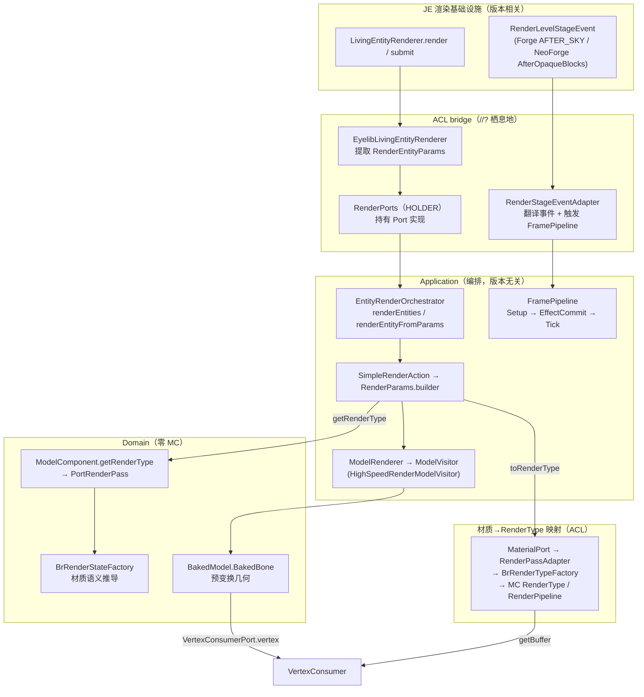
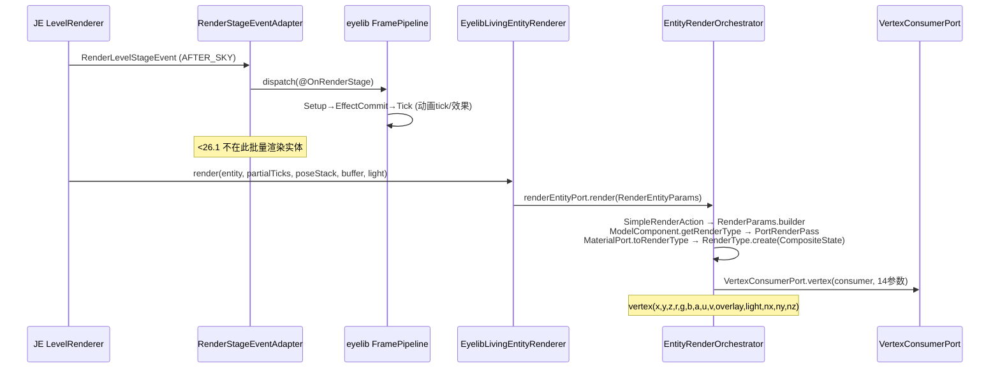
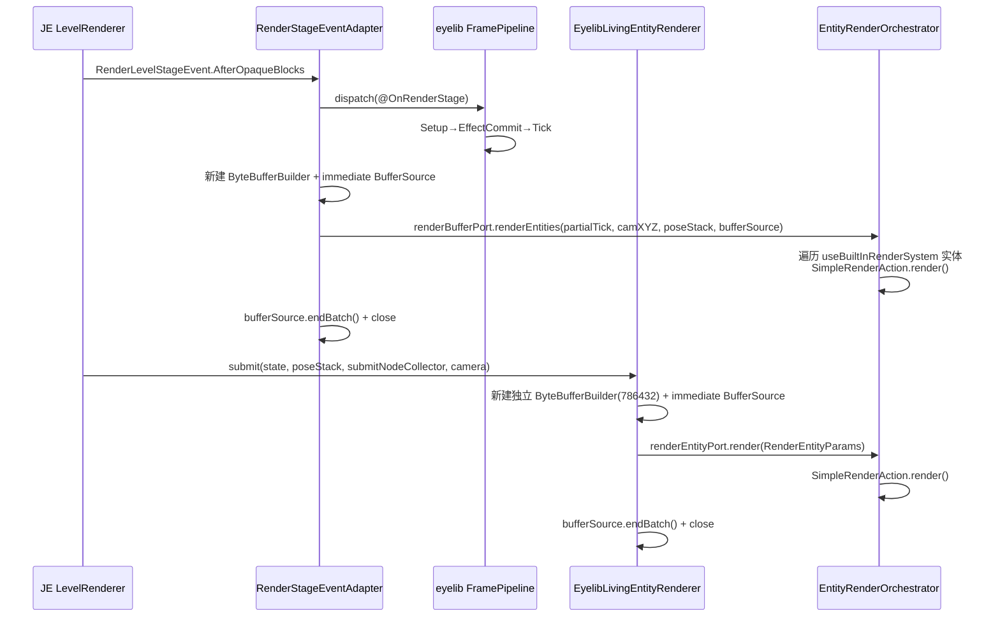

# 跨版本渲染流程设计

> **工作单元类型**：计划（设计规格文档）
> **输入**：`docs/vanilla_research/geo_render/{1.20.1,1.21.1,26.1.2}.md`（vanilla 三版本几何渲染管线研究）
> **架构契约**：ADR-0015（Stonecutter 多版本 + L1/L2/L3 差异分级）、ADR-0016（DDD 四层 + `//?` 唯一栖息地）、ADR-0017（26.1.2 纯 `//?` 编译）
> **范围**：eyelib 复刻 Bedrock 实体/几何渲染，需在同一份源码上产出 1.20.1 / 1.21.1 / 26.1.2 三个版本的可用 jar。本文档系统化该跨版本渲染流程的设计。

---

## 1. 设计目标

| 目标 | 含义 |
|------|------|
| **一套源码三版本** | 单 `src/` + Stonecutter `//?` + bridge Port，产三个 node 的 jar |
| **Bedrock 语义不变量** | 不论 JE 版本如何变迁，eyelib 对外暴露的 Bedrock 渲染语义（材质继承、render pass、骨骼变换）行为一致 |
| **差异可定位** | 任何版本差异都能在 ADR-0015 的 L1/L2/L3 框架内归位，且 `//?` 只出现在 bridge（ADR-0016 §6） |
| **热路径可验证** | 渲染执行链每个 Port 都有可观测的不变量，可用 ArchUnit + clientsmoke 验证 |

---

## 2. 问题域：三版本 vanilla 渲染范式差异

geo_render 三份文档揭示了一个**两次断裂**的演进：

### 2.1 断裂一：1.20.1 → 1.21.1（增量演进）

实体管线**几乎不变**（`LivingEntityRenderer.render` 立即模式、`ModelPart` 树、`RenderType` 状态巨类、`MultiBufferSource.BufferSource.endBatch`）。断裂集中在区块侧：

| 维度 | 1.20.1 | 1.21.1 |
|------|--------|--------|
| 区块调度 | `ChunkRenderDispatcher` | `SectionRenderDispatcher` + `SectionCompiler`（拆分） |
| 网格产物 | `RenderedBuffer` | `MeshData` |
| 顶点缓冲 | `ByteBufferBuilder` 直接 | `ByteBufferBuilder`（堆外可增长） |

**对 eyelib 的影响**：可忽略。eyelib 不走区块管线（它是实体/几何渲染库），1.20.1↔1.21.1 的差异对实体渲染主路径无影响，仅 API 命名层（`ResourceLocation` 构造、事件总线 Forge↔NeoForge、`partialTick` 取值）。

### 2.2 断裂二：1.21.1 → 26.1.2（范式革命）

26.1.2 从「OpenGL 状态机 + 立即模式绘制」转向「声明式 PSO + 帧图 + 延迟提交」。**实体管线被彻底重写**，直击 eyelib 主路径：

| 维度 | 1.20.1 / 1.21.1 | 26.1.2 |
|------|------------------|--------|
| GPU 管线状态 | 代码手动 `RenderSystem.glEnable/glBlendFunc` | **`RenderPipeline`** 声明式 PSO（不可变） |
| 渲染类型 | `RenderType` 内含所有状态（format+shader+texture+blend...） | `RenderType` = name + **`RenderSetup`**（包装 `RenderPipeline` + 运行时纹理/目标） |
| 实体渲染 | 立即模式：`render()` 直接写顶点并绘制 | **两阶段**：`extractRenderState()` 提取状态 → `submit()` 收集提交节点 → `FeatureRenderDispatcher` 批量绘制 |
| 实体数据 | 渲染器直接持有 `Entity` | **`EntityRenderState`**（先提取，再 submit） |
| 着色器 | `ShaderInstance`（每 RenderType 绑定） | `ShaderManager`（集中管理源码，管线预编译） |
| 渲染层叠加 | `RenderLayer.render()`（立即） | `Feature` 系统（`FeatureRenderDispatcher` 调度） |
| 渲染调度 | 直接 `draw` / `endBatch` | `FrameGraphBuilder` 声明 Pass，统一执行 |
| 渲染阶段事件 | `RenderLevelStageEvent.Stage.AFTER_SKY` | `RenderLevelStageEvent.AfterOpaqueBlocks`（细分事件类型） |
| `LivingEntityRenderer` 泛型 | `<T, M>` 双泛型 | `<T, State, M>` 三泛型 |
| 顶点写入 | `vertex(x,y,z,...)` 14 参数 | `addVertex(x,y,z).setColor()...` 链式 |
| 资源标识 | `ResourceLocation` | `Identifier` |

### 2.3 关键结论

eyelib 的跨版本张力**几乎全部来自 1.21.1 → 26.1.2**。1.20.1 ↔ 1.21.1 是 L1 级别的机械差异；1.21.1 → 26.1.2 在实体渲染调度（立即 vs 两阶段提交）和 RenderType 架构（状态巨类 vs PSO）上是 **L2/L3 级别**的范式差异（ADR-0015 §2）。

---

## 3. eyelib 跨版本渲染架构现状

### 3.1 四层模型（ADR-0016）

```
┌─────────────────────────────────────────────────────────┐
│ Application（编排，版本无关）                            │
│   client/render/EntityRenderOrchestrator                │
│   client/render/pipeline/{FramePipeline,FramePlan,...}  │
│   client/render/{SimpleRenderAction,RenderParams,...}   │
│   client/render/visitor/ModelVisitor 体系               │
├────────────── 通过 Port 接触 MC ─────────────────────────┤
│ ACL bridge（翻译，//? 唯一栖息地）                       │
│   bridge/client/render/{VertexConsumerPort,PoseStackPort}│
│   bridge/client/render/EyelibLivingEntityRenderer        │
│   bridge/client/render/adapter/{RenderPorts,EntityRenderSystem,...}│
│   bridge/material/{MaterialPort,RenderTypeResolver,...}  │
│   bridge/material/adapter/{BrRenderTypeFactory,RenderPassAdapter}│
├─────────────────────────────────────────────────────────┤
│ Domain（领域模型，零 MC，零 //?）                        │
│   material/{material,render,port,gl,shared}              │
│   model/ animation/ molang/ ...                          │
└─────────────────────────────────────────────────────────┘
         Infrastructure：mixin/（PoseStack/PoseStack.Pose accessor）
```

**关键现状**（ArchUnit，ADR-0016 §Verification）：
- `material/` 等 Domain 包**零 `//?`**、**零 `net.minecraft.*`** ✅
- bridge 是 `//?` 的（预期）唯一栖息地，但存在过渡期债务（见 §7.4）

### 3.2 Port 契约清单

| Port / 适配点 | 层 | 吸收的差异 | 版本边界 | 文件 |
|---------------|-----|-----------|----------|------|
| `VertexConsumerPort.vertex` | ACL | vertex 14参 vs addVertex 链式 | `<1.20.6` | `bridge/client/render/VertexConsumerPort.java:11-27` |
| `PoseStackPort.{copy,identity,replaceLast,getLastPoseMatrix}` | ACL | PoseStack 内部结构 + Pose 构造 | `<1.20.6`/`<26.1`/`>=26.1` | `bridge/client/render/PoseStackPort.java` |
| `EntityRenderPorts.RenderSystemPort` | ACL | registry/mixin/item 渲染/buffer flush/slot/EquipmentSlot 演进 | `<1.20.6`/`<26.1`/`>=26.1` | `bridge/client/render/adapter/EntityRenderSystem.java` |
| `EntityRenderPorts.{RenderBufferPort,RenderEntityPort,SetupClientEntityPort}` | ACL | 渲染回调入口（屏蔽 JE 调度差异） | — | `bridge/client/adapter/EntityRenderPorts.java` |
| `EyelibLivingEntityRenderer` | ACL | LivingEntityRenderer 两代（render vs submit） | `<26.1`/`>=26.1` | `bridge/client/render/EyelibLivingEntityRenderer.java:43-134` |
| `RenderStageEventAdapter` | ACL | 渲染阶段事件 + 调度分歧 | `<1.20.6`/`<26.1`/`>=26.1` | `bridge/client/render/adapter/RenderStageEventAdapter.java:34-64` |
| `BrRenderTypeFactory` | ACL | BrRenderState → RenderType(create) / RenderPipeline(PSO) | `<26.1`/`>=26.1` | `bridge/material/adapter/BrRenderTypeFactory.java:6-49,110-354` |
| `RenderPassAdapter` | ACL | PortRenderPass → 标准 RenderType / RenderTypes | `<26.1`/`>=26.1` | `bridge/material/adapter/RenderPassAdapter.java:27-56` |
| `ResourceLocationBridge` | ACL | ResourceLocation ↔ Identifier | `<1.20.6`/`<26.1`/`>=26.1` | `bridge/material/ResourceLocationBridge.java` |
| `PortRenderPass`（Domain 侧） | Domain | Bedrock render pass 语义（Transparency enum） | —（版本无关） | `material/port/PortRenderPass.java` |

### 3.3 渲染执行链（统一抽象）



**顶点写入热路径**（`HighSpeedRenderModelVisitor`，三版本唯一汇聚点）：
```
BakedBone.transformPos(last.pose())     // PoseStack 矩阵，PoseStackPort 屏蔽结构差异
BakedBone.transformNormal(last.normal())
VertexConsumerPort.vertex(consumer,     // 屏蔽 vertex(14参) vs addVertex() 链式
    pos.xyz, r,g,b,a, u,v, overlay, light, n.xyz)
```

---

## 4. 跨版本差异吸收矩阵

按 ADR-0015 L1/L2/L3 分级，每个渲染相关差异归位：

| # | 差异 | 级别 | 吸收机制 | 版本边界 | 验证状态 |
|---|------|------|----------|----------|----------|
| D1 | `VertexConsumer.vertex(14参)` → `addVertex().setColor()...` | L1 | `VertexConsumerPort` 静态方法 `//?` | `1.20.6` | ✅ 1.20.1/1.21.1 编译运行 |
| D2 | `PoseStack.poseStack` 字段 → mixin accessor → `last().set()` | L1 | `PoseStackPort` + `PoseStackAccessor`/`PoseStackPoseAccessor` mixin | `1.20.6`/`26.1` | ✅ 编译 |
| D3 | `PoseStack.Pose` 构造（`new` → accessor → `new PoseStack().last()`） | L1 | `PoseStackPort.identity/copy` `//?` | `1.20.6`/`26.1` | ✅ |
| D4 | `LivingEntityRenderer<T,M>` → `<T,State,M>` + `render` → `submit` | **L2** | `EyelibLivingEntityRenderer` 整类 `//?` 切分两份 | `26.1` | ⚠️ 26.1.2 编译，未运行验证 |
| D5 | `RenderType`（状态巨类）→ `RenderType`+`RenderSetup`(`RenderPipeline` PSO) | **L2** | `BrRenderTypeFactory.custom` `//?` 两份 + `PIPELINE_CACHE` | `26.1` | ⚠️ 26.1.2 编译，未运行 |
| D6 | `RenderType.entityXxx` → `RenderTypes.entityXxx` | L1 | `RenderPassAdapter` switch `//?` 两份 | `26.1` | ⚠️ 26.1.2 编译 |
| D7 | `ResourceLocation` → `Identifier` | L1 | `ResourceLocationBridge` `//?` 三分支 | `1.20.6`/`26.1` | ✅ |
| D8 | `RenderLevelStageEvent.Stage.AFTER_SKY` → `AfterOpaqueBlocks`（事件类型） | L1 | `RenderStageEventAdapter` `//?` | `26.1` | ⚠️ |
| D9 | **渲染调度分歧**：立即模式（JE 调 render） vs 两阶段（submit + 全局批量） | **L2/L3** | `RenderStageEventAdapter` 双路径（见 §5.4/§7.1） | `26.1` | ⚠️ **设计张力，待验证** |
| D10 | Forge `@Mod.EventBusSubscriber` → NeoForge `@EventBusSubscriber` | L1 | adapter 类注解 `//?` | `1.20.6` | ✅ |
| D11 | `ForgeRegistries` → `BuiltInRegistries` | L1 | `EntityRenderSystem.getEntityTypeId` `//?` | `1.20.6` | ✅ |
| D12 | `event.getPartialTick()` → `getGameTimeDeltaPartialTick(false/true)` | L1 | `RenderStageEventAdapter` `//?` | `1.20.6`/`26.1` | ✅ |
| D13 | 包迁移（`animal.horse` → `animal.equine`，`animal.Sheep` → `animal.sheep.Sheep`） | L1 | import `//?` | `26.1` | ✅ |
| D14 | `EquipmentSlot` 新增 `BODY`(1.21)/`SADDLE`(26.1) | L1 | `RenderSystemPort.slotName` switch `//?` 三份 | `1.20.6`/`26.1` | ✅ |
| D15 | `LightTexture.FULL_BRIGHT` → 字面量 `0xF000F0` | L1 | 常量 `//?` | `26.1` | ✅ |

**结论**：渲染主路径的差异 86% 是 L1（机械改名/API 签名），由 bridge 的 `//?` 吸收。两个 L2（D4/D5）用整类/整方法 `//?` 切分。唯一未定级的是 **D9（调度分歧）**，它是设计张力的来源（§7.1）。

---

## 5. 三版本渲染路径规格

### 5.1 统一抽象（三版本共同）

**前置条件**：
- `RenderPorts.install()` 已在 `ClientBootstrap.wire()`（由 `RenderStageLifecycleHooks.onCommonSetup` 反射触发）完成，HOLDER 非空
- `EntityRenderOrchestrator.wirePorts()` 已注册 `RenderBufferPort`/`RenderEntityPort`/`SetupClientEntityPort` 三个 Port 实现
- 实体携带 `RenderData` capability，且 `useBuiltInRenderSystem == true`（默认）

**不变量（I）**：
- **I1**：Bedrock 材质语义（继承归并、defines/states 推导、Transparency 分类）由 Domain 层 `material/` 完全决定，三版本行为一致；bridge 只翻译，不改变语义
- **I2**：`PortRenderPass` 是 Domain↔ACL 的唯一渲染类型契约，不依赖任何 MC 类型
- **I3**：顶点写入只通过 `VertexConsumerPort.vertex`，不绕过
- **I4**：PoseStack 操作只通过 `PoseStackPort` + mixin accessor，不直接访问内部结构

**后置条件**：
- 每帧每个可见且 `useBuiltInRenderSystem` 的实体，其 Bedrock 几何被正确变换并写入对应 `RenderType` 的 `VertexConsumer`
- `FramePipeline`（eyelib 自己的，非 MC `RenderPipeline`）每帧执行 Setup→EffectCommit→Tick，完成动画 tick 与效果提交

### 5.2 1.20.1 路径（active，已验证）



**特征**：
- 实体渲染由 JE 标准 `render()` 立即调度，每个实体在 JE 主循环中被调用
- `RenderStageEventAdapter` 只触发 `FramePipeline`（动画/效果），不参与几何绘制
- `RenderType` = `RenderType.create(name, format, mode, ..., CompositeState)` 状态巨类（`BrRenderTypeFactory.custom` `<26.1` 分支）

### 5.3 1.21.1 路径（node，编译验证）

与 5.2 结构**完全一致**，仅 L1 差异：
- 事件总线 NeoForge（`@EventBusSubscriber(modid="eyelib")`）
- `partialTick` 取 `getGameTimeDeltaPartialTick(false)`
- `ResourceLocation.fromNamespaceAndPath` 替代 `new ResourceLocation`
- `VertexConsumer.addVertex().setColor()...` 链式（经 `VertexConsumerPort` 屏蔽）
- `BuiltInRegistries` 替代 `ForgeRegistries`
- `EquipmentSlot.BODY` 已存在

### 5.4 26.1.2 路径（node，编译验证，⚠️ 运行未验证）



**特征**：
- `RenderType` = `RenderSetup.builder(RenderPipeline).withTexture(...)`，`RenderPipeline` 由 `RenderPipelines.ENTITY_SNIPPET`/`ENTITY_EMISSIVE_SNIPPET` 基座 + `buildColorTargetState/buildDepthStencilState/buildStencilTest` 构建（`BrRenderTypeFactory.custom` `>=26.1` 分支，`PIPELINE_CACHE: Map<BrRenderState, RenderPipeline>` 共享 PSO）
- `LivingEntityRenderer<T, EyelibEntityRenderState, EmptyEntityModel>` 三泛型，`extractRenderState` + `submit` 两阶段
- 顶点格式 `addVertex(x,y,z).setColor().setUv().setOverlay().setLight().setNormal()`

> ⚠️ **设计张力（详见 §7.1）**：上图显示 `renderBufferPort.renderEntities()`（全局批量）与 `submit()`（每实体 immediate）**两条路径都会触发** `renderEntityPort.render()`，对 `useBuiltInRenderSystem==true` 的实体存在双重渲染风险。

---

## 6. Port 契约规格

### 6.1 `VertexConsumerPort`

```java
static void vertex(VertexConsumer, x,y,z, r,g,b,a, u,v, overlay, light, nx,ny,nz)
```
- **前置**：`consumer` 非空，已通过 `multiBufferSource.getBuffer(renderType)` 获取且对应 `RenderType` 处于 begin 状态
- **后置**：写入一个完整实体顶点（`DefaultVertexFormat.NEW_ENTITY`/`ENTITY`）
- **不变量**：调用方无需感知 `vertex(14参)` vs `addVertex()` 链式；颜色 `r,g,b,a∈[0,1]` 由调用方保证
- **副作用**：推进 `VertexConsumer` 内部顶点计数
- **异常**：`consumer` 为 null 时 NPE（由调用方 `renderParams.consumer() != null` 守卫，见 `HighSpeedRenderModelVisitor:54`）

### 6.2 `EntityRenderPorts.RenderSystemPort`

- **前置**：`RenderPorts.get()` HOLDER 已 install
- **关键方法**：
  - `pushPoseRaw(poseStack, pose)` — 直接向 PoseStack 栈压入预构造的 `Pose`（用于 locator bone 复用），屏蔽 `<1.20.6` 字段直访 / `<26.1` mixin accessor（`>=26.1` 该方法体为空，因 API 已支持）
  - `renderItemDirect(...)` — 仅 `<26.1` 实现（`>=26.1` 物品渲染路径待补，见 §7.3）
  - `flushBuffer(source)` — 仅 `<26.1` 实现
  - `slotName(slot)` — EquipmentSlot→Bedrock slot 字符串，三版本 switch
  - `FULL_BRIGHT` — 常量 `//?`（`LightTexture.FULL_BRIGHT` vs `0xF000F0`）
- **不变量**：对同一 `EquipmentSlot`，`slotName` 返回值在语义上版本一致（仅随新 slot 枚举值扩展）

### 6.3 `RenderStageEventAdapter`（调度入口，版本分歧核心）

| 版本 | 行为 |
|------|------|
| `<26.1` | 订阅 `AFTER_SKY`，仅 `dispatch`（触发 FramePipeline）。实体几何绘制由 JE 调 `EyelibLivingEntityRenderer.render` 完成 |
| `>=26.1` | 订阅 `AfterOpaqueBlocks`，`dispatch` **+** 新建全局 `BufferSource` 调 `renderBufferPort.renderEntities()` 全局批量绘制。同时 JE 仍调 `submit()` |

> 该 Port 是 §7.1 双重渲染张力的源头，是 D9 唯一未定级的差异。

### 6.4 `BrRenderTypeFactory` / `RenderPassAdapter`（材质→RenderType）

- **前置**：`BrRenderState` 已由 `BrRenderStateFactory.from(ResolvedBrMaterial)` 推导（Domain，版本无关）
- **不变量 I1**：同一 `(BrRenderState, texture)` 产出的 MC `RenderType` 被缓存（`CACHE`/`PIPELINE_CACHE`），幂等
- **不变量 I2**：`>=26.1` 下，相同 `BrRenderState` 共享同一 `RenderPipeline` PSO（`PIPELINE_CACHE`），仅 `RenderSetup` 的 texture/lightmap 维度不同
- **后置**：返回的 `RenderType` 可直接喂 `MultiBufferSource.getBuffer`
- **副作用**：首次调用某 `(state, texture)` 时填充缓存；`>=26.1` 首次调用某 `BrRenderState` 时构建并注册 `RenderPipeline`

---

## 7. 识别的设计张力与风险

### 7.1 ⚠️【高风险】26.1.2 双重渲染

**现象**：`RenderStageEventAdapter`（`>=26.1`，行 50-63）的 `renderBufferPort.renderEntities()` 与 `EyelibLivingEntityRenderer.submit()`（行 109-122）都会对 `useBuiltInRenderSystem==true`（默认）的实体调用 `renderEntityPort.render()` → `SimpleRenderAction.render()` → 实际几何写入。

**根因**：26.1.2 的两阶段 submit 范式下，eyelib 同时保留了两条路径：
- 路径 A（submit）：JE 标准调度，每实体 immediate buffer
- 路径 B（renderBufferPort）：eyelib 自主全局批量

两条无互斥守卫，`useBuiltInRenderSystem` 默认 `true`（`RenderData.java:61`）使两者重叠。

**影响**：同一实体几何被写入两次 → 视觉重影 / 性能翻倍 / 半透明叠加错误。

**为何未暴露**：26.1.2 运行时因 JVM OOM 崩溃（`versions/26.1.2/hs_err_pid92052.log`，Java 25 G1 内存分配失败），渲染流程**未经运行时验证**。`:26.1.2:build` SUCCESSFUL（ADR-0017）仅证明编译通过。

**建议处理**（待执行工作单元确认）：
- 方案 1：`>=26.1` 下让 `submit()` 成为 no-op（实体完全由 `renderBufferPort` 全局批量），保留 submit 仅作 JE 调度占位
- 方案 2：`>=26.1` 下移除 `renderBufferPort.renderEntities()` 全局批量，完全依赖 submit（但丧失批量优势，见 7.2）
- 方案 3：用 `RenderData` 增加标志区分两类实体，互斥分流

> **本设计文档不预设结论**——这是 26.1.2 node 运行时验证后需决策的执行项。当前记录为已知风险。

### 7.2【中风险】26.1.2 submit 丧失批量优势

`submit()`（行 116-121）每实体新建 `ByteBufferBuilder(786432)` + immediate `BufferSource`，立即 `endBatch` + `close`。这违背 26.1.2 `SubmitNode` 延迟提交 + `FeatureRenderDispatcher` 按 `RenderType` 批量绘制的设计意图，导致每实体一次 draw call。

若采纳 §7.1 方案 2（纯 submit），需重构 submit 为收集 `SubmitNode` + 共享 buffer，而非 immediate。若采纳方案 1/3，则 submit 可保持 thin。

### 7.3【中风险】26.1.2 renderItemDirect / flushBuffer 为空

`EntityRenderSystem.renderItemDirect`（行 86-89）与 `flushBuffer`（行 93-99）的 `>=26.1` 分支**方法体为空**。意味着 26.1.2 下：
- 手持物渲染（`renderItemInHand`→`renderHandItem`→`renderItemDirect`）不会执行
- buffer flush 不执行

这是 26.1.2 未完成的子路径，待执行工作单元补全（26.1.2 物品渲染需走新的 `ItemRenderer` / SubmitNode 路径）。

### 7.4【低风险/债务】ADR-0016 过渡期债务

ADR-0016 §"过渡期已知债务"记录的、与渲染流程相关的债务：
- `bridge/` 反向引用 application 层（`aclMustNotDependOnApplication` baseline 360+ 行），含 `bridge/client/render/` 部分
- `//?` 散布在 application/domain（`StonecutterCommentPlacementTest` baseline 43 文件），含 `client/render/`、`model/Model.java`
- `BrRenderTypeFactory` 混合翻译 + Bedrock 材质语义（ADR-0016 §3 违规案例 #1），需拆分：翻译留 ACL，材质推导规则移 Domain

这些不影响三版本渲染流程的功能正确性，但影响可维护性与架构纯净度。建议作为独立的"债务偿还"执行工作单元，不在本设计文档范围内强制解决。

### 7.5【低风险】命名混淆：eyelib FramePipeline vs MC RenderPipeline

`client/render/pipeline/FramePipeline`（eyelib 帧生命周期：Setup→EffectCommit→Tick）与 26.1.2 的 `com.mojang.blaze3d.pipeline.RenderPipeline`（MC GPU PSO）**完全无关**，但名称相近。scout 报告已识别。建议在代码注释/文档中明确区分（FramePipeline = 帧阶段编排，RenderPipeline = GPU 管线状态对象）。

---

## 8. 验证策略

| 层级 | 手段 | 覆盖 | 现状 |
|------|------|------|------|
| 编译 | `:1.20.1:build` / `:1.21.1:build` / `:26.1.2:build` | 三版本 `//?` 切分正确性 | 1.20.1 ✅ 1.21.1 ✅ 26.1.2 ✅（ADR-0017） |
| 架构 | ArchUnit（ADR-0016 §Verification） | Domain 零 MC、`//?` 栖息地、ACL 不依赖 Application | Domain ✅；bridge→application baseline 债务 |
| 运行（几何） | clientsmoke 实体捕获（`clientsmoke/smoke/`） | 1.20.1 实体渲染像素正确性 | 1.20.1 ✅ |
| 运行（材质） | clientsmoke `MaterialCoverageSmoke` / `RenderTypeBridgeSmoke` | 材质→RenderType 映射 | 1.20.1 ✅ |
| 运行（26.1.2） | 待 OOM 解决后 runClient | §7.1 双重渲染、§7.3 物品路径 | ⚠️ **未验证**（OOM 阻塞） |

**26.1.2 验证阻塞项**：
1. 解决 JVM OOM（降低 `-Xmx` / 调整 G1 配置 / 检查 Java 25 堆基址）
2. runClient 后用 `/eval`（eyelib-debug MCP）或 clientsmoke 验证：
   - 单实体无重影（验证 §7.1）
   - 手持物可见（验证 §7.3）
   - 材质 Transparency 分类正确（cutout/translucent/emissive）

---

## 9. 与 vanilla geo_render 研究的对应关系

本设计如何消费三份 vanilla 研究文档：

| vanilla 研究章节 | eyelib 跨版本设计的对应 |
|------------------|------------------------|
| §2 实体几何管线（ModelPart 树、render、顶点写入） | eyelib 不复用 vanilla ModelPart，自建 `Model.Bone`/`BakedBone` + `ModelVisitor`；仅顶点写入终点对齐 `DefaultVertexFormat.NEW_ENTITY`/`ENTITY`（§3.3） |
| §3.1 RenderType 系统 | `BrRenderTypeFactory` 把 Bedrock 语义映射到 vanilla RenderType（<26.1）/ RenderPipeline PSO（>=26.1）（§6.4） |
| §3.2 顶点缓冲系统 | eyelib 不自建 VBO，复用 vanilla `MultiBufferSource.BufferSource` + `VertexConsumer`，仅 `VertexConsumerPort` 屏蔽 API 差异 |
| §3.3 着色器系统 | eyelib 不自建着色器，复用 vanilla entity 着色器（经 RenderType/RenderPipeline 绑定） |
| §3.4/§3.5 主渲染循环 + GPU 上传 | eyelib 接入点 = `RenderLevelStageEvent`（§5）；GPU 上传完全委托 vanilla `endBatch`/`RenderPass` |
| 26.1.2 §2.2 两阶段 submit | `EyelibLivingEntityRenderer` 的 `>=26.1` 分支实现 `extractRenderState`+`submit`（§5.4），但与全局批量路径存在张力（§7.1） |

**设计原则**：eyelib 是 Bedrock 渲染语义在 JE 基础设施上的**薄映射层**，不重写 vanilla 管线，只在材质语义→RenderType、骨骼变换→顶点写入两个接缝处做翻译。vanilla 三版本的基础设施差异（PSO、submit、FrameGraph）被 bridge Port 吸收，对 Application 层不可见。

---

## 10. 结论与后续执行项

eyelib 的跨版本渲染流程**架构骨架已就位且自洽**：Domain（零 MC）→ ACL bridge（`//?` 唯一栖息地，翻译）→ Application（编排，版本无关），通过 Stonecutter 三节点产 jar。1.20.1/1.21.1 的渲染路径已验证；26.1.2 编译通过但运行时验证被 OOM 阻塞。

**设计层面无需返工**——D1~D8、D10~D15 的 L1 差异已由 bridge `//?` 正确吸收，D4/D5 的 L2 差异已用整类/整方法切分实现。唯一的设计决策悬而未决：

| 执行项 | 性质 | 前置 | 风险 |
|--------|------|------|------|
| 26.1.2 双重渲染决策（§7.1 方案 1/2/3） | 设计决策 | runClient（OOM 解决后） | 高 |
| 26.1.2 renderItemDirect/flushBuffer 补全（§7.3） | 实现补全 | runClient | 中 |
| ADR-0016 渲染相关债务偿还（§7.4） | 重构 | 独立工作单元 | 低 |

> 本设计文档作为后续执行工作单元的规格基准。每个执行项应另起 `work/<task>/` 规格，引用本文档相应章节。
